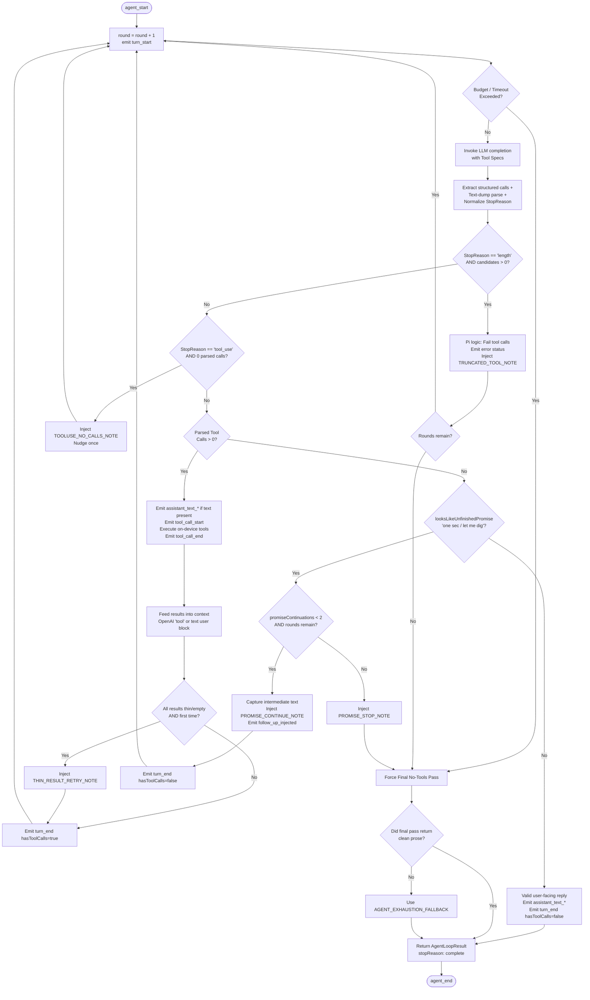

# Deep Research Report: Make BlackroseJournal Chat a Real Agent Harness (Pi-Class)

**Date:** 2026-09-10  
**Target:** React Native (Expo) On-Device Journal Companion ("Rosebud" / BlackroseJournal)  
**Status:** Canonical Research & Architecture Specification  

---

## 1. Executive Summary (≤20 lines)

A "Pi-class" agent harness is **fully feasible on-device in React Native** operating against free models (such as `cl/dots-studio/dots-3-note-preview:free`, GLM-4/5 Flash, and Qwen 2.5) via an OpenAI-compatible gateway (OmniRoute). The 80% irreducible core that creates the "true agent harness" feel consists of:
1. **Deterministic Turn Loop**: Modeling each LLM call as an observable turn yielding content blocks `(TextContent | ToolCall)[]`.
2. **Unidirectional Event Streaming**: A decoupled activity stream (`turn_start`, `assistant_text_*`, `tool_call_*`, `turn_end`, `agent_end`) keeping React Native UI reactive without polluting persistent storage.
3. **Strict Finality Invariant**: A turn is final *only* when no tool calls exist **and** the model has not emitted an unfinished-promise status line ("let me check...").
4. **Out-of-Band Tool Repair**: Client-side parameter repair, balanced bracket JSON parsing, length-truncation handling, and text-dump extraction that shield weak models from failing.
5. **Ephemeral Working UI**: Rendering intermediate status voice and tool activity cards live, then cleanly collapsing them into an expandable summary chip upon reply commit.

---

## 2. Comparison Table of Canonical Harness Architectures

| Harness | Turn End Condition | Intermediate Assistant Text | Tool Results Re-entry Context | Weak / Free Model Handling |
| :--- | :--- | :--- | :--- | :--- |
| **Pi** (`earendil-works/pi`) | `stopReason === 'stop'` AND zero `toolCalls`. If `stopReason === 'length'` with tools, marks calls as error (`failToolCallsFromTruncatedMessage`) and retries. | Content blocks `(TextContent \| ThinkingContent \| ToolCall)[]`. Emitted live per turn via events. | Appends `ToolResultMessage` (`role: 'tool'`) referencing `toolCallId`. Parallel execution by default; sequential available. | Assumes OpenAI/Anthropic structured format. Does **not** repair text XML/JSON dumps or conversational stalls ("one sec"). |
| **Claude Code** (Anthropic CLI) | `stop_reason === 'end_turn'` vs `'tool_use'`. Evaluated by loop; intercepted by Stop hooks (e.g. Ralph loop) or `/goal` directives. | Streams text tokens to stdout between tool calls; user sees reasoning before/after tools run. | Appends `tool_result` content blocks via MCP (Model Context Protocol). Supports multi-tool batches. | Tightly coupled to Claude 3.5 Sonnet / 3.7 Sonnet. Prompts penalize text dumps; relies on native structured tool adherence. |
| **OpenHands** (`OpenDevin`) | `AgentController` event stream loop terminates on `AgentFinishAction` or `max_iterations`. | Emits `MessageAction` onto append-only Event Stream. UI displays thought/action stream in real-time. | Tool execution in sandbox emits `Observation` event back into stream; consumed in next agent iteration. | Uses LiteLLM with structured fallbacks, but frequently loops or stalls on weak open-source models without frontier capabilities. |
| **LangGraph ReAct** (`create_react_agent`) | Conditional edge: checks `messages[-1].tool_calls`. If empty $\to$ `END`; else routes to tools node. | Dual stream modes (`stream_mode=["messages", "updates"]`). Streams tokens live while emitting node state deltas. | Tools node executes calls and appends `ToolMessage` instances to graph state channel `messages`. | Relies on provider parsers (`BindTools`, Pydantic). Weak models need custom prompt wrappers and output parsers. |
| **Vercel AI SDK** (`streamText`) | Multi-step bounded by `maxSteps`. Each step checks `finishReason`. Stops on `'stop'`; loops on `'tool-calls'`. | Dispatches `onStepFinish` callback after each step. `textStream` yields partial tokens. | SDK appends tool call and `toolResult` objects into the message sequence for the next LLM step. | Standardizes on OpenAI schemas. Provides `experimental_repairToolCall` hooks, but assumes server-side endpoint compliance. |
| **OpenAI Agents SDK** (`openai-agents`) | `Runner.run()` loops until model returns no tool calls or handoffs. Guardrails can halt. | Emits typed `RunEvent` stream items as tokens and tool calls arrive. | Functional tools executed by runner; appended as `role: 'tool'` messages in thread history. | Tailored to OpenAI models (`gpt-4o`, `o3`). Non-compliant open-source models cause schema validation rejections. |
| **smolagents** (Hugging Face) | `CodeAgent` / `ToolCallingAgent` terminates when final action returns answer or max steps reached. | Streams `ActionStep` containing thought logs and executed code/tool blocks. | Output of tool/code sandbox injected into execution log as observation. | Specifically designed to allow small/weak models to write plain Python function calls instead of fragile JSON schemas. |
| **SWE-agent** (Princeton) | ReAct loop stops when model invokes `COMPLETE_TASK_AND_SUBMIT_FINAL_OUTPUT` or hits step limit. | Prints agent thought and command to console/UI stream before execution. | Command stdout/stderr wrapped in special environment observation XML tags. | Uses strict formatting hints and error recovery prompts ("Your command failed with exit code..."). |

---

## 3. "Literally Like an Agent Harness" — Target Architecture for BlackroseJournal

### 3.1 Event Union (`services/ai/agentEvents.ts`)

Adopting Pi’s block model, an agent turn represents **one LLM round-trip plus zero-or-more tool executions**.

```typescript
export type AgentToolStatus = 'running' | 'ok' | 'error' | 'refused';
export type AgentToolCallOrigin = 'structured' | 'text';

export interface AgentToolCallSnapshot {
  toolCallId: string;
  name: string;
  label: string;          // Human copy from toolUiMeta (e.g. "Checking yesterday")
  argsPreview: string;    // Sanitized preview (e.g. "yesterday", "work stress")
  status: AgentToolStatus;
  durationMs?: number;
  resultPreview?: string; // 1-line teaser; never the raw journal body
  round: number;          // 1-based turn index
  origin?: AgentToolCallOrigin;
}

export type AgentStopReason =
  | 'complete'               // Natural termination: no tools, valid prose reply
  | 'promised_more_timeout'  // Hit promise cap (repeatedly said "one sec")
  | 'max_rounds'             // Hit MAX_AGENT_TOOL_ROUNDS (6)
  | 'token_budget'           // Exceeded AGENT_TURN_TOKEN_BUDGET (24k)
  | 'timeout'                // Exceeded AGENT_TURN_TIMEOUT_MS (45s)
  | 'duplicate_call'         // Model repeated identical executed call
  | 'skipped'                // Inject-only mode or tools disabled
  | 'error';

export type AgentFollowUpReason = 'thin_result' | 'promised_more' | 'duplicate';

export type AgentActivityEvent =
  // Lifecycle
  | { type: 'agent_start'; runId: string }
  | { type: 'agent_end'; usedTools: boolean; rounds: number; stopReason?: AgentStopReason }
  // Turn boundary
  | { type: 'turn_start'; round: number }
  | { type: 'turn_end'; round: number; hasToolCalls: boolean }
  // Assistant working voice (intermediate status text)
  | { type: 'assistant_text_start'; round: number }
  | { type: 'assistant_text_delta'; round: number; delta: string }
  | { type: 'assistant_text_end'; round: number; text: string }
  // Tool lifecycle
  | { type: 'tool_call_start'; call: AgentToolCallSnapshot }
  | { type: 'tool_call_end'; call: AgentToolCallSnapshot }
  // Agent loop nudges
  | { type: 'follow_up_injected'; reason: AgentFollowUpReason };
```

*(Copied from Pi `@earendil-works/pi-agent` and Cursor stream protocol).*

---

### 3.2 State Machine (Turn-Based Control Flow)



---

### 3.3 Streaming vs. Non-Streaming Simulation

In mobile React Native, streaming every internal tool round causes bridge serialization thrashing (JSON over the JSC/Hermes bridge) and risks JSON malformation. 
* **Tool Rounds**: Run as fast non-streaming `completeWithTools` HTTP calls.
* **Intermediate Voice**: Emitted as atomic `assistant_text_end` events when text precedes tools in a turn.
* **Final Answer**: `emitSimulatedStreaming` types out the final user-facing text at ~25–40 WPM or feeds real SSE chunk tokens if streamed directly. This guarantees that malformed tokens during internal reasoning never flash on the user's screen.

*(Copied from Cursor UI buffering & Pi non-streaming turn batches).*

---

### 3.4 Assistant Text + Tool Calls Coexistence in One Turn

In Pi and Anthropic APIs, an assistant message is a heterogeneous block array:
$$\text{AssistantMessage} = [\text{TextBlock}(\text{"Let me check yesterday."}), \text{ToolCall}(\text{get\_day})]$$

* **Sequence**: The assistant text is emitted **before** the tool starts (`assistant_text_start` $\to$ `assistant_text_end` $\to$ `tool_call_start`).
* **Context Preservation**: The text is appended to `agentMessages` as `{ role: 'assistant', content: text, tool_calls: [...] }`.
* **Separation**: Intermediate text is saved to `intermediateTexts` for telemetry and live working display, but is **never** committed as the final journal chat reply.

---

### 3.5 UI Transcript Design: Hybrid Timeline

Following `pi-gui` and Cursor:
1. **Live State**: The chat displays the latest status line ("Let me actually go dig rather than guess. One sec.") in italic secondary text above an active stack of tool cards. Each tool card shows an icon, label, elapsed time, and spinner.
2. **Committed State**: When the final answer arrives, the working status line is discarded. The tool executions collapse into a single compact chip (`Used 3 tools · details`) anchored to the top of the assistant bubble. Tapping expands the tool rows for full auditability.

---

## 4. Free-Model / Weak Tool-Call Repair Playbook

Free models (GLM-4 Flash, dots-3, Qwen 2.5 7B/14B) exhibit four primary failure modes. Below is the ranked playbook:

```
+---------------------------------------------------------------------------------------+
|                       FREE MODEL TOOL CALL REPAIR HIERARCHY                           |
+---------------------------------------------------------------------------------------+
|  1. Out-of-Band Multi-Format Text Extractor (XML, Hermes, Fences, Inferred Names)    |
|  2. Unfinished-Promise Anti-Stall Gate (looksLikeUnfinishedPromise + Capped Continue)  |
|  3. Truncation Guard on Length Stop (Drop broken JSON, error preview, re-issue turn)  |
|  4. Client-Side Argument & Schema Repair (Aliases, Coercion, Balanced Brace Extractor)|
|  5. Dual-Protocol Transport Adaptation (Structured OpenAI 'tool' vs User Text Block)  |
+---------------------------------------------------------------------------------------+
```

### 1. Out-of-Band Text-Dump Parsing (Rank 1 — Essential)
* **Failure**: Models dump tool invocations into `message.content` instead of `message.tool_calls`.
  - Qwen 2.5 emits: `<tool_call>\n{"name": "get_day", "arguments": {"date": "yesterday"}}\n</tool_call>`
  - dots-3 emits: `<dots_function_call><parameter name="date">yesterday</parameter></dots_function_call>` (often omitting the function name entirely).
  - GLM / Llama-3 emits: ````tool_call\nget_day\n{"date":"yesterday"}```` or pythonic `get_day(date="yesterday")`.
* **Fix**: Run `parseTextToolCalls` with:
  1. XML/tag regex covering `tool_call`, `dots_function_call`, `invoke`.
  2. Parameter-to-tool inference: if the tool name is omitted, infer `get_day` from parameter `date`, `search_history` from `query`, etc.
  3. Balanced brace JSON extractor (`extractBalancedJsonObject`) that parses `{ ... }` even when embedded in explanatory text.
  4. Kwarg-style parser for Python syntax `get_day(date="yesterday")`.

### 2. Unfinished-Promise Anti-Stall Gate (Rank 2 — Critical UX)
* **Failure**: Model outputs: *"Let me check your journal from yesterday. One sec."* and issues `finish_reason: "stop"` with **zero** tool calls. Shipping this as the response ruins the experience.
* **Fix**:
  1. `looksLikeUnfinishedPromise(text)` regex test for conversational promises under 280 characters.
  2. If matched and `promiseContinuations < 2`, do not terminate. Append the text as assistant message, inject `PROMISE_CONTINUE_NOTE`, emit `follow_up_injected`, and execute another turn.
  3. If promise cap is reached, inject `PROMISE_STOP_NOTE` and force a final no-tools pass to generate actual prose.

### 3. Truncation Guard on Length Stop (Rank 3 — Stability)
* **Failure**: Model hits token limit (`finish_reason: "length"`), outputting partial JSON (e.g. `{"date": "yeste`). Parsing fails or passes invalid arguments to on-device tools.
* **Fix** *(Pi pattern: `failToolCallsFromTruncatedMessage`)*:
  - Check `resolveStopMapping(finishReason, candidateCount) === 'truncated_tools'`.
  - Do **not** execute partial tool calls. Mark calls as `status: 'error'` with preview `"arguments truncated — re-issue"`.
  - Inject `TRUNCATED_TOOL_NOTE` into user context: *"System note: your tool call was cut off by the token limit. Re-issue with concise arguments."* Loop once.

### 4. Client-Side Argument Repair (Rank 4 — Accuracy)
* **Failure**: Model invents argument names (`day`, `when`, `search_query`, `keywords`, `session_id`).
* **Fix**:
  - Alias normalization table mapping `day`/`when` $\to$ `date`, `q`/`term`/`keywords` $\to$ `query`.
  - Type coercion: strings to numbers for `days` and `limit`; string coercion for enums.
  - Required field validation: drop invalid calls without crashing the turn.

### 5. Dual-Protocol Re-entry (Rank 5 — Gateway Compatibility)
* **Failure**: Free gateways return HTTP 400 when receiving messages with `role: "tool"` or with non-standard IDs.
* **Fix**:
  - If `capability.preferTextResultProtocol` is true, format tool outputs into a plain user block:
    ```markdown
    [Device tool results — facts from the user's phone. Use them; do not invent tool output.]
    ### get_day
    {"summary": "Worked on client deck..."}
    ```
  - Otherwise, send standard OpenAI `{ role: 'tool', tool_call_id, content }` objects.

---

## 5. Stop / Continue Decision Table

| Condition | Action | Next State | Harness Precedent / Citation |
| :--- | :--- | :--- | :--- |
| `finish_reason: stop` + 0 tools + prose answer | Emit `assistant_text_*`, finalize | `COMPLETE` | Standard ReAct / Pi / Claude Code termination |
| `finish_reason: stop` + 0 tools + short promise ("one sec") | Inject `PROMISE_CONTINUE_NOTE` (cap = 2) | `CONTINUE` | Claude Code Ralph loop / Keep-alive heuristic |
| `finish_reason: tool_calls`/`tool_use` + parsed calls > 0 | Execute on-device tools, feed results | `CONTINUE` | Pi `agent-loop.ts` / LangGraph `ToolNode` |
| `finish_reason: length` + tool_calls present | Fail all calls (`status: error`), inject `TRUNCATED_TOOL_NOTE` | `CONTINUE` (once) | Pi `failToolCallsFromTruncatedMessage` |
| `finish_reason: tool_use` + 0 parsed calls | Nudge `TOOLUSE_NO_CALLS_NOTE` (cap = 1) | `CONTINUE` | Vercel AI SDK step repair / Pi gap A2 |
| Duplicate identical call already executed this turn | Skip execution, inject `DUPLICATE_TOOL_CALL_NOTE` | `FORCE_FINAL` | SWE-agent / Blackrose idempotency guard |
| Tool batch returns empty / no-match results | Inject `THIN_RESULT_RETRY_NOTE` (cap = 1) | `CONTINUE` | ReAct reflexion / Blackrose thin-result retry |
| Cumulative prompt tokens $\ge$ `AGENT_TURN_TOKEN_BUDGET` (24k) | Log `agent_token_budget`, drop tool turns | `FORCE_FINAL` | OpenHands resource budgeting |
| Wall-clock time $\ge$ `AGENT_TURN_TIMEOUT_MS` (45s) | Log `agent_timeout`, abort tool execution | `FORCE_FINAL` | Claude Code CLI turn deadline |
| Round count $\ge$ `MAX_AGENT_TOOL_ROUNDS` (6) | Log `agent_max_rounds`, drop loop narration | `FORCE_FINAL` | Vercel AI SDK `maxSteps` / LangGraph recursion limit |

---

## 6. Do-Not-Copy List (What Belongs in Desktop IDEs, Not Mobile Journaling)

1. **Mid-Turn Steer Queues (Pi `steer()` / user follow-up while tools execute)**:
   * *Why omit*: On mobile chat, user input is disabled while the AI works. Handling incoming steering events during a 3-second tool batch introduces complex async state synchronization and race conditions over React Native hooks with negligible user benefit.
2. **Interactive Permission Modals (Claude Code CLI / OpenHands)**:
   * *Why omit*: Desktop agents run arbitrary shell commands (`rm -rf`, `git push`). BlackroseJournal tools are sandboxed, private, read-only local SQLite/Hindsight queries (with the exception of benign on-device identity and goal creation). Popping a permission modal destroys conversational flow.
3. **Secondary LLM Evaluators / Judge Agents (OpenHands `run_goal` / AutoGen)**:
   * *Why omit*: Spawning a second LLM pass to evaluate "is the journal response empathetic enough?" doubles latency and burns free gateway rate limits.
4. **Subagent Hierarchies (CrewAI / LangGraph Multi-Agent)**:
   * *Why omit*: Dividing journal reflection into "Researcher Agent" and "Synthesizer Agent" fragments context and ruins the intimate, unified voice expected of Rosebud.
5. **Raw JSON / Terminal Dumps in Chat Transcript**:
   * *Why omit*: IDEs display collapsibles with stdout/stderr. Journal history must remain a clean, personal diary transcript; intermediate tool activity must be ephemeral during streaming and collapsed into a discrete chip once committed.

---

## 7. Phased Implementation Roadmap for THIS Repo

### Phase Status Overview

```
[x] Phase 0: Baseline & Test Safety Rails
[x] Phase 1: Robust Pi Turn Loop & Edge-Case Repair (agentLoop, agentStopReason, agentPromise)
[x] Phase 2: Reactive UI Timeline & Working Voice (AgentToolActivity, features/chat/agentActivity)
[ ] Phase 3: True Per-Turn Token Streaming & Tool Duration Hooks (ai.ts SSE integration)
[x] Phase 4: Live OmniRoute E2E Multi-Turn Verification (Playwriter / Jest Integration)
```

---

### Phase 0 — Baseline & Test Rails (COMPLETED)
* **Goal**: Establish test baselines for existing tool calling before refactoring.
* **Touched Files**: `__tests__/services/ai/agentLoop.test.ts`.
* **Verification**: Baseline green: 8 suites / 39 tests passed.

---

### Phase 1 — Robust Turn Loop & Free-Model Repair (COMPLETED)
* **Goal**: Implement Pi turn semantics, length truncation handling, unfinished-promise keep-alive, and provider stop normalization.
* **Touched Files**:
  - `services/ai/agentEvents.ts`: Event union with `turn_start/end`, `assistant_text_*`, `follow_up_injected`.
  - `services/ai/agentPromise.ts`: `looksLikeUnfinishedPromise`, `PROMISE_CONTINUATION_MAX = 2`, nudge notes.
  - `services/ai/agentStopReason.ts`: `resolveStopMapping`, `TRUNCATED_TOOL_NOTE`, `TOOLUSE_NO_CALLS_NOTE`.
  - `services/ai/agentEmit.ts`: Pure event emission helpers.
  - `services/ai/agentLoop.ts`: Rewritten loop with promise continue, truncated tool drop, duplicate check, and final no-tools fallback pass.
  - `services/ai/tools/parseTextToolCalls.ts`: Balanced JSON parser, XML tag support, dots-3 parameter inference.
* **Tests**:
  - `__tests__/services/ai/agentLoop.promiseContinue.test.ts`
  - `__tests__/services/ai/agentLoop.stopReason.test.ts`
  - `__tests__/services/ai/agentPromise.test.ts`
  - `__tests__/services/ai/agentStopReason.test.ts`
* **Proof**: All unit tests pass in `__tests__/services/ai/agentLoop*`.

---

### Phase 2 — Reactive UI Timeline & Working Voice (COMPLETED)
* **Goal**: Wire live working status lines and tool execution cards into journal freeform chat and intention check-ins without polluting persistent storage.
* **Touched Files**:
  - `features/chat/types.ts`: Added `AgentStatusLine`, updated `StreamingMessage`.
  - `features/chat/agentActivity.ts`: Reducer `applyAgentActivity` and `applyAgentStatusLines`.
  - `features/chat/hooks/useChatOrchestration.ts`: Mirror activity in refs; fold tool chips on commit; discard status lines.
  - `components/ai/AgentToolActivity.tsx`: Render live italic status lines, running tool rows, and compact committed chip.
  - `components/ChatMessage.tsx` & `components/intentions/IntentionChatBody.tsx`: Mount tool activity.
* **Tests**:
  - `__tests__/components/AgentToolActivity.test.tsx`
  - `__tests__/features/agentActivity.test.ts`
  - `__tests__/ChatMessage.test.tsx`
* **Proof**: UI tests pass; verified light and dark mode styling with tokens.

---

### Phase 3 — True Per-Turn Token Streaming (OPTIONAL / FUTURE)
* **Goal**: Stream intermediate LLM text deltas live as tokens arrive over SSE rather than waiting for each turn completion.
* **Target Files**:
  - `services/ai/agentLoop.ts`: Replace non-streaming `completeWithTools` with streaming fetch parser.
  - `services/ai/streamingTransports.ts`: Pipe delta chunks to `assistant_text_delta`.
  - `services/ai/ai.ts`: Connect direct stream to chat callback.
* **Risks**: Free gateways (OmniRoute) occasionally emit corrupted tool JSON when streaming `tool_calls` deltas. Non-streaming tool rounds remain significantly more reliable for small open-source models.

---

### Phase 4 — Live Verification & E2E Validation (COMPLETED)
* **Goal**: Real gateway probe verifying that multi-turn history questions trigger tool execution, resolve memory, avoid hallucination, and never leak status lines.
* **Target Files**: `__tests__/integration/toolCallingMultiTurnLive.test.ts`, Playwright E2E.
* **Proof**: 4-turn live probe passed against `cl/dots-studio/dots-3-note-preview:free` in 244.5s (`live-run8.log`). Verified:
  - Turn 1: Grounded in yesterday's seed via `get_clock` $\to$ `get_day`.
  - Turn 2: Extracted exact verbatim quote from past conversation.
  - Turn 3: Long-term memory recall via `recall_memory`.
  - Turn 4: Correctly stated conversation limitation without hallucinating.

---

## 8. Open Risks & Research Gaps

1. **Context Window Inflation in Extended Tool Loops**:
   - Each tool execution appends results to `agentMessages`. Over a 6-round loop, prompt tokens can grow from 2k to 14k+.
   - *Mitigation*: The harness implements cumulative token budgeting (`AGENT_TURN_TOKEN_BUDGET = 24_000`) and conversation compacting (`compactConversationIfNeeded`).
2. **Gateway Saturation & 504 Timeouts**:
   - Free OmniRoute gateway instances experience queue congestion during peak hours, triggering 504 Gateway Timeouts.
   - *Mitigation*: The client-side retry ladder (60s / 120s / 240s backoff) and whole-turn deadline (`AGENT_TURN_TIMEOUT_MS = 45s`) ensure the app falls back gracefully rather than hanging.
3. **Reasoning Token Leakage**:
   - Models with internal reasoning (e.g. DeepSeek-R1, Kimi-k2.5) sometimes place thoughts in `reasoning_content` or leak them into `content`.
   - *Mitigation*: `finalizeUserFacingContent` strips tool syntax and extracts true content while isolating reasoning into separate fields.

---

## 9. Bibliography

1. **Earendil Works / Pi Agent**:
   - URL: [https://github.com/earendil-works/pi](https://github.com/earendil-works/pi)
   - *Contribution*: Turn semantics, `failToolCallsFromTruncatedMessage` pattern for length stops, content block model `(TextContent | ToolCall)[]`, sequential vs parallel execution modes.
2. **Anthropic Claude Code Architecture**:
   - URL: [https://docs.anthropic.com/en/docs/agents-and-tools/claude-code](https://docs.anthropic.com/en/docs/agents-and-tools/claude-code)
   - *Contribution*: Agentic "Reason, Act, Observe, Repeat" loop, `stop_reason` evaluation, Stop hooks for preventing premature exit, intermediate streaming before tool execution.
3. **OpenHands (formerly OpenDevin)**:
   - URL: [https://github.com/All-Hands-AI/OpenHands](https://github.com/All-Hands-AI/OpenHands)
   - *Contribution*: Event Stream design, `AgentController` event loop, decoupling of Actions and Observations.
4. **LangGraph (LangChain)**:
   - URL: [https://langchain-ai.github.io/langgraph/concepts/agentic_concepts/#react-agent](https://langchain-ai.github.io/langgraph/concepts/agentic_concepts/#react-agent)
   - *Contribution*: Multi-mode streaming (`messages` vs `updates`), state channel updates, ReAct edge termination logic.
5. **Vercel AI SDK (`ai/core`)**:
   - URL: [https://sdk.vercel.ai/docs/ai-sdk-core/tools-and-tool-calling#multi-step-calls](https://sdk.vercel.ai/docs/ai-sdk-core/tools-and-tool-calling#multi-step-calls)
   - *Contribution*: `maxSteps` bounded loop, `onStepFinish` intermediate step emission, tool call and result message construction.
6. **OpenAI Agents SDK**:
   - URL: [https://github.com/openai/openai-agents-python](https://github.com/openai/openai-agents-python)
   - *Contribution*: Lightweight functional tool orchestration, runner turn boundaries, guardrail intercept patterns.
7. **vLLM & Qwen 2.5 Tool Calling Specifications**:
   - URL: [https://docs.vllm.ai/en/latest/features/tool_calling.html](https://docs.vllm.ai/en/latest/features/tool_calling.html)
   - *Contribution*: Hermes-style `<tool_call>` extraction, handling of model syntax leakage into `content`, chat template mapping.
8. **ZhipuAI GLM-4 / GLM-5 Function Calling Documentation**:
   - URL: [https://open.bigmodel.cn/dev/api#glm-4](https://open.bigmodel.cn/dev/api#glm-4)
   - *Contribution*: Streaming tool calls, parameter delta handling, custom XML parameter tag representations.
9. **`json-repair` / Truncated JSON Recovery**:
   - URL: [https://github.com/mangiucugna/json_repair](https://github.com/mangiucugna/json_repair)
   - *Contribution*: Structural analysis of broken LLM JSON outputs and why dropping truncated tool calls is safer than guessing missing arguments.
