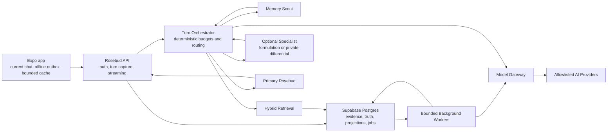

# Cloud-Authoritative Rosebud Memory System

**Status:** Approved design, ready for implementation planning

**Date:** 2026-07-28

**Product:** BlackroseJournal / Rosebud

**Audience:** Personal use and a small invite-only circle of trusted friends

**Positioning:** A journaling companion with therapist-like conversational skill; not a clinical mental-health product

**Primary objective:** Maximum-quality longitudinal continuity with proportionate latency, cost, privacy, and operational complexity

## 1. Executive summary

Rosebud will move from a phone-local memory system to a cloud-authoritative memory platform. The cloud will own completed conversations, message evidence, changing facts, people and aliases, episodes, open threads, interaction preferences, source-linked summaries, search indexes, embeddings, rollups, background jobs, and deletion state. The phone will retain the current rendered conversation, encrypted offline drafts and outbox events, a bounded cache, authentication state, and user-facing memory controls.

The design is evidence-first. Exact user-authored messages are the authoritative source. Facts and relationships are temporal claims with explicit validity, observation time, confidence, evidence, counterevidence, and lifecycle status. Embeddings, digests, rollups, graph edges, user summaries, and patterns are rebuildable projections rather than permanent truth. Assistant-authored text and repeated model interpretations can never become evidence about the user.

Every conversational turn follows a bounded live pipeline:

1. Persist the user message and a durable outbox event.
2. Run a small structured Memory Scout.
3. Search cloud memory through entity, lexical, semantic, temporal, open-thread, and preference routes.
4. Fuse the results into a compact source-linked Turn Blackboard.
5. Route through the normal two-call path or, when expected value justifies it, one specialist call.
6. Let Primary Rosebud produce the only user-visible response.
7. Run deterministic response checks and schedule asynchronous curation.

Normal conversation uses two model calls: Memory Scout and Primary Rosebud. A complex turn may add either the Deep Formulation Consultant or the separately enabled Private Differential, for a maximum of three routine live calls. The Turn Orchestrator is deterministic software, not another model. A response supervisor is an exceptional retry/replacement path, not a fourth routine call.

Rosebud receives an always-on temporal orientation pack of approximately 3,000–5,000 tokens plus approximately 2,000–3,000 tokens of tool definitions. The pack includes the exact local clock, identity core, current-life snapshot, interaction policy, recent context, this week, last week, a non-duplicative two-week delta, month-to-date direction, open threads, changing or uncertain facts, and turn-specific evidence. Tools remain available for exact source retrieval. Cached projections allow software to assemble this pack without an additional live model call.

The background system uses durable typed jobs rather than an always-running autonomous swarm. Cheap capture occurs on every accepted message. Session curation, reconciliation, embeddings, temporal summaries, outcome observation, pattern review, and period rollups run at lifecycle boundaries or in the background. Jobs are idempotent, retryable, traceable, replayable, version-fenced, and visible when dead-lettered.

The migration will proceed through LOCAL, MIRROR, SHADOW, and CLOUD authority states on a per-user basis. Existing local evidence remains intact while the cloud imports, rebuilds, and shadow-compares its results. The phone’s heavy local memory stores are retired only after source parity, longitudinal recall, deletion, live-provider E2E, and human conversational-quality gates pass.

## 2. Why the current architecture is insufficient

The existing local system is valuable and should be treated as the migration source, but it does not reliably satisfy the intended one-year companion promise.

Observed architectural limitations include:

- The local memory capsule can be ranked from the previous message instead of the current turn.
- An ordinary mention of a person does not reliably trigger deep history retrieval.
- Several topical searches operate on recent slices rather than the full archive.
- Entry deletion does not have a universal dependency graph that invalidates every atom, identity field, digest, session record, embedding, rollup, and cache.
- Day digest behavior can conflate write date and event date and can replace earlier same-day material.
- Changing scalar identity facts are handled better than changing relationships, events, and multi-valued facts.
- The current stores do not provide a general bitemporal representation of current truth versus historical truth.
- Local embeddings may still send text to a remote provider, making “local” an incomplete privacy description.
- Year rollup storage exists, but year-scale implicit recall is not reliably available on every relevant turn.
- AsyncStorage storage and background processing place growing responsibility on the phone.
- Debugging multi-stage extraction failures on a mobile device is difficult.
- Unit tests demonstrate that mechanisms work in isolation, but do not prove longitudinal conversational behavior.

The cloud design is therefore not a remote copy of the existing atom store. It replaces the truth model, retrieval contract, curation lifecycle, observability, and deletion semantics while preserving the best parts of the current shared chat engine and prompt discipline.

## 3. Goals

### 3.1 Product goals

- Remember at least one year of conversations and journals without dumping full history into every prompt.
- Resolve people, aliases, changing relationships, projects, places, routines, preferences, and open threads.
- Understand vague continuity such as “he did it again” or “that thing from last month” when evidence supports a likely interpretation.
- Preserve current truth and historical truth without overwriting the past.
- Use sensitive history with restraint; relevance alone must not force an explicit mention.
- Adapt response length, question count, advice mode, directness, warmth, pacing, and memory posture from user feedback.
- Make ordinary day-sharing, joy, humor, resilience, and growth as retrievable as conflict and trauma.
- Keep the user-facing experience as one natural companion rather than an agent committee.
- Reduce phone storage, background work, and provider orchestration.
- Make extraction, retrieval, routing, cost, failures, and deletion inspectable on the backend.

### 3.2 Engineering goals

- Make raw user-authored evidence the only authoritative source for autobiographical claims.
- Make all derived memory source-linked, versioned, and rebuildable.
- Guarantee idempotent capture and durable background scheduling.
- Separate event time, mention time, claim validity time, and system observation time.
- Provide hybrid retrieval over the complete eligible archive.
- Assemble a bounded 3,000–5,000-token temporal memory pack each turn without a new model call.
- Cap the normal live route at two model calls and the complex route at three.
- Use Supabase Postgres, full-text search, and pgvector as the initial small-deployment data platform.
- Reuse the existing Node backend as a modular monolith for orchestration and workers.
- Preserve UI → hooks → services layering and the shared `useChatOrchestration` chat stack.
- Provide per-user migration and feature flags with safe forward-repair behavior.

## 4. Non-goals

- Positioning Rosebud as a therapist, clinician, diagnostic service, treatment provider, or crisis-care replacement.
- Creating a covert permanent diagnostic dossier.
- Allowing model-written text to become user truth.
- Autonomous prompt rewriting, self-modifying code, unsupervised fine-tuning, or learned policy outside typed and reversible records.
- Optimizing for time spent, message count, disclosure volume, emotional intensity, or dependence.
- Running every logical role as an independent always-on model agent.
- Full server-blind end-to-end encryption; cloud agents require temporary access to evidence.
- Enterprise compliance, multi-region residency, per-user KMS hierarchies, or large-team operational controls in the trusted-circle release.
- Permanent dual local/cloud authority.
- A new third chat surface or a fork of the shared chat orchestration engine.

## 5. Approved architecture decisions

| Concern | Decision |
|---|---|
| Memory authority | Cloud-authoritative raw evidence and derived memory |
| Mobile responsibility | Current conversation, encrypted draft/outbox, bounded cache, auth, controls |
| Cloud platform | Supabase Postgres + full-text search + pgvector |
| Application backend | Existing Node backend evolved into a modular monolith |
| Background execution | Durable typed Postgres-backed jobs with bounded workers |
| Truth model | Evidence-first and bitemporal |
| Retrieval | Semantic preflight plus progressive hybrid retrieval |
| Always-on context | 3–5k temporal orientation pack plus approximately 2–3k of tools |
| Live model calls | Two normally; three selectively |
| User-facing speaker | Primary Rosebud only |
| Interaction learning | Consent-aware Preference Ledger with bounded outcome learning |
| Formulation | Plural, evidence-bound, advisory Deep Formulation Consultant |
| Diagnostic reasoning | Optional ephemeral Private Differential with explicit opt-in |
| Curation | Always-durable capture plus tiered background curation |
| Security | Lean trusted-circle baseline |
| Cost routing | Adaptive expected-value routing |
| Migration | Mirror → rebuild → shadow → staged cutover |
| Verification | Longitudinal evidence gates and progressive release |

## 6. System invariants

These are architectural laws, not tuning preferences.

1. **User-authored evidence only.** A fact about the user must trace to an eligible user-authored message revision or an explicit user action.
2. **Assistant text is never evidence.** A model repeating an idea cannot increase its confidence.
3. **Current messages outrank memory.** The current user turn can correct or supersede retrieved history.
4. **Explicit preferences outrank inferred preferences.**
5. **Facts are temporal.** Current, historical, disputed, retracted, and candidate claims remain distinguishable.
6. **Event and mention dates remain separate.**
7. **Retrieval is not permission to mention.** Mention value and sensitivity are evaluated after relevance.
8. **Patterns are hypotheses, never diagnoses or identity.**
9. **Private differential output never enters durable autobiographical memory.**
10. **Raw journal content is untrusted data, never executable instruction.**
11. **Primary Rosebud is the only user-facing model role.**
12. **The normal route uses no more than two model calls; the complex route uses no more than three.**
13. **Background failure cannot erase the source or its work request.**
14. **Every background mutation is idempotent and version-fenced.**
15. **Editing or deleting source evidence immediately removes retrieval eligibility and invalidates dependents.**
16. **Derived artifacts record model, prompt, schema, job, and input versions.**
17. **No cross-user evidence can appear in queries, prompts, exports, or responses.**
18. **Response generation reserves cannot be consumed by memory injection.**
19. **No natural-language keyword routing.** Semantic interpretation comes from structured models; deterministic logic is limited to validation, authorization, budgets, deadlines, and policy.
20. **The system does not optimize for dependence or engagement.**

## 7. System topology



The backend remains one deployable service initially. “Scout,” “Curator,” “Reconciler,” and similar terms describe logical roles and job handlers, not independently deployed microservices.

## 8. Runtime ownership

### 8.1 Phone

The phone owns:

- Current rendered conversation state.
- Encrypted draft text and attachments not yet accepted by the server.
- A serialized, encrypted network outbox with stable client event IDs.
- A bounded recent-response and context cache.
- Authentication session state.
- Network and sync status.
- User-facing memory, preference, privacy, export, and deletion controls.
- A read-only migration snapshot during the cutover observation window.

The phone does not own after cutover:

- Durable full transcripts.
- Ranked memory atoms.
- Identity profile truth.
- Day, session, week, month, or year memory projections.
- Embedding indexes.
- Full-history search.
- Memory extraction or rollup workers.
- Provider routing for the primary cloud companion path.

### 8.2 Rosebud backend

The backend owns:

- Supabase JWT verification and per-request owner scoping.
- Turn acceptance and durable transactional outbox writes.
- Streaming orchestration.
- Memory Scout invocation.
- Context-pack assembly.
- Hybrid retrieval and evidence fusion.
- Adaptive route selection.
- Model/provider gateway.
- Background worker leases, retries, replay, and dead letters.
- Curation, reconciliation, embedding, summaries, rollups, and deletion.
- Trace metadata, cost, latency, and benchmark versioning.

### 8.3 Supabase Postgres

Postgres owns:

- Authoritative source records.
- Temporal claims and evidence links.
- Derived projections and dependency links.
- Full-text and vector indexes.
- User settings and memory authority state.
- Durable job queue and attempts.
- Migration manifests and verification state.
- Tombstones and deletion verification.

## 9. Data model

All tables containing user data include `owner_id`, use RLS, and are accessed through owner-scoped backend repositories. Applied migrations are never edited; the cloud memory schema is introduced through new migration files.

### 9.1 Source evidence

#### `memory_conversations`

| Field | Purpose |
|---|---|
| `id` | Stable conversation ID preserved across migration |
| `owner_id` | Supabase user |
| `source_kind` | `journal`, `freeform_chat`, `intention_checkin`, or future source |
| `source_record_id` | Optional existing entry/check-in ID |
| `status` | `draft`, `active`, `settled`, `deleted` |
| `started_at` | UTC instant |
| `settled_at` | UTC instant, nullable |
| `timezone` | IANA timezone observed at start |
| `week_starts_on` | User calendar preference snapshot |
| `client_schema_version` | Source serialization version |
| `source_hash` | Canonical source hash |
| `created_at`, `updated_at`, `deleted_at` | Lifecycle timestamps |

#### `memory_messages`

| Field | Purpose |
|---|---|
| `id` | Stable message ID |
| `owner_id`, `conversation_id` | Ownership and parent |
| `client_event_id` | Retry-safe unique ID per owner |
| `role` | `user`, `assistant`, `system`, `tool` |
| `sequence` | Stable order within conversation |
| `authored_at` | UTC instant |
| `authored_timezone` | IANA zone at authorship |
| `local_date` | Derived local calendar date |
| `content` | Current visible content |
| `content_hash` | Integrity and idempotency |
| `revision` | Monotonic source revision |
| `status` | `active`, `edited`, `deleted` |
| `created_at`, `updated_at`, `deleted_at` | System lifecycle |

The unique constraint is `(owner_id, client_event_id)`. A retry returns the previously accepted record instead of creating a duplicate.

The existing `journal_entries.messages` and `intention_checkins.messages` JSONB fields remain compatibility projections during migration; they do not become a second writable transcript authority. In CLOUD state, normalized `memory_messages` are authoritative for AI evidence. Journal/check-in rows retain product metadata such as title, emoji, status, intention, and summary, while their legacy message arrays are derived or retired through a later additive migration.

#### `memory_message_revisions`

Every edit creates an immutable revision containing the prior content, content hash, authored metadata, and lifecycle reason. Only the current eligible revision is used for retrieval. Revision history supports correction audits and deterministic dependent invalidation.

#### `memory_evidence_spans`

| Field | Purpose |
|---|---|
| `id` | Evidence ID |
| `owner_id`, `message_revision_id` | Source |
| `start_offset`, `end_offset` | Exact span |
| `span_hash` | Integrity without requiring duplicate plaintext in logs |
| `evidence_kind` | `explicit_statement`, `explicit_correction`, `explicit_preference`, `episode_description`, etc. |
| `eligibility` | `eligible`, `withheld`, `deleted`, `expired` |
| `created_by_job_id` | Producing job |

Only spans from user-authored revisions can support autobiographical claims. Assistant spans may be stored for conversation reconstruction but are ineligible as user evidence.

### 9.2 Entities and aliases

#### `memory_entities`

Represents people, organizations, places, projects, pets, roles, and other reference targets. An entity is a reference anchor, not a bag of unquestioned properties.

Core fields:

- `id`, `owner_id`
- `entity_type`
- `display_name`
- `status`: `candidate`, `active`, `merged`, `split`, `deleted`
- `confidence`
- `created_from_evidence_id`
- `merged_into_id`
- timestamps and version

#### `memory_entity_aliases`

Stores names, nicknames, pronoun descriptions, relationship descriptions such as “my ex,” and context-dependent aliases. Each alias includes evidence, confidence, validity, and ambiguity state. Two people with the same name remain separate until evidence justifies a merge.

### 9.3 Bitemporal claims

#### `memory_claims`

| Field | Purpose |
|---|---|
| `id`, `owner_id` | Identity |
| `subject_kind`, `subject_id` | User or entity |
| `predicate` | Typed relation |
| `object_kind`, `object_value`, `object_entity_id` | Typed value |
| `valid_from`, `valid_to` | When the claim is true in the user’s world |
| `observed_at` | When Rosebud learned it |
| `recorded_at` | Database transaction time |
| `confidence` | Calibrated confidence |
| `explicitness` | `explicit`, `strong_inference`, `weak_inference` |
| `status` | `candidate`, `current`, `historical`, `disputed`, `retracted`, `deleted` |
| `sensitivity` | Mention/retrieval handling |
| `supersedes_claim_id` | Explicit temporal chain |
| `producing_job_id`, `model_version`, `schema_version` | Provenance |

#### `memory_claim_evidence`

Links a claim to supporting or counterevidence spans with a relationship type and contribution weight. Model-generated descriptions are never accepted as claim evidence.

An explicit correction can close the old claim’s `valid_to`, create a current claim, and retain the old claim as historical. Ambiguous correction creates a disputed candidate and prevents confident assertion until reconciled.

### 9.4 Episodes

#### `memory_episodes`

Represents events and experiences rather than timeless facts.

Core fields:

- `id`, `owner_id`
- short source-grounded summary
- `event_started_at`, `event_ended_at`
- `event_time_precision`: exact, day, week, month, relative, unknown
- `event_time_confidence`
- `mentioned_at`
- local timezone/calendar metadata
- emotional context without diagnostic labels
- importance axes: practical relevance, relationship relevance, unfinishedness, positive salience, adversity salience, recency
- sensitivity and mention posture
- status and lifecycle version

#### `memory_episode_entities`

Links participants, places, projects, and roles to episodes. Links include confidence and evidence.

### 9.5 Open threads

#### `memory_open_threads`

Tracks upcoming, unresolved, postponed, completed, dismissed, and no-longer-relevant matters.

Fields include:

- title and source-grounded description
- status
- due/event time and precision
- `follow_up_allowed`
- `do_not_nag`
- last mentioned time
- next eligible reminder time
- completion/dismissal evidence
- sensitivity

Open threads guide continuity but never authorize unsolicited reminders when `do_not_nag` or a boundary applies.

### 9.6 Interaction Preference Ledger

#### `interaction_preferences`

| Field | Purpose |
|---|---|
| `key` | Length, question budget, advice mode, directness, warmth, pacing, memory posture, etc. |
| `value` | Typed JSON validated by preference schema |
| `scope_kind` | `global`, `session`, `situation`, `topic`, `time_window` |
| `scope_value` | Typed matcher, never raw executable text |
| `source_kind` | `explicit`, `corroborated`, `inferred` |
| `confidence` | Authority and conflict resolution |
| `valid_from`, `expires_at` | Lifecycle |
| `status` | `candidate`, `active`, `weakened`, `revoked`, `expired` |
| `evidence_id` | User-authored source |

The current turn has highest authority, followed by explicit durable preferences, explicit contextual preferences, corroborated candidates, inferred candidates, and product defaults.

#### `interaction_outcomes`

Stores cautious observations such as explicit correction, “that helped,” regenerate/edit, repeated frustration, and next-turn feedback. It does not store an engagement reward. Outcome processing may strengthen, weaken, narrow, expire, or propose confirmation of a preference; it cannot rewrite prompts or model weights.

### 9.7 Pattern hypotheses

#### `memory_pattern_hypotheses`

Pattern hypotheses include:

- neutral source-grounded description
- scope and time window
- confidence
- minimum support episode count
- next review date
- decay rule
- status: candidate, active, weakened, dismissed, expired, deleted
- producing model/prompt/schema versions

#### `memory_pattern_evidence`

Requires separate support and counterexample links. A pattern cannot become active without multiple distinct episodes and at least an explicit counterevidence search. Patterns cannot contain diagnoses or become identity fields.

### 9.8 Rebuildable projections

#### `memory_temporal_digests`

Supports:

- session digest
- local calendar day
- week-to-date
- completed week
- rolling two-week delta
- month-to-date
- completed month
- year
- current-life snapshot
- identity projection
- open-thread projection

Each digest stores:

- period boundaries and timezone
- source conversation/message/episode IDs
- content
- source hash aggregate
- model/prompt/schema versions
- build job ID
- freshness status
- invalidation version
- token estimate

The two-week delta describes changes and persistence between periods instead of repeating both weekly summaries. Month-to-date contributes the broader arc and older material rather than restating current-week detail.

#### `memory_search_documents`

Search documents normalize eligible source messages, episodes, claims, digests, and open threads for:

- Postgres full-text search.
- pgvector semantic search.
- entity and alias joins.
- temporal filters.
- sensitivity and deletion filters.

Each record includes a content hash, source pointer, projection kind, embedding model/version, and eligibility state.

#### `memory_dependencies`

Represents derived-artifact dependency edges. Every projection links to its source evidence and upstream projections. Edit and deletion traverse this graph to remove retrieval eligibility immediately and schedule rebuilds.

#### `memory_context_snapshots`

Caches versioned context-pack blocks, not one opaque prompt. Blocks can be independently invalidated and reassembled.

### 9.9 Job and trace records

#### `memory_jobs`

Core fields:

- `id`, `owner_id`
- `job_type`
- `idempotency_key`
- `source_version`
- `payload_reference`, not unrestricted raw prompt logging
- `priority`
- `status`: queued, leased, succeeded, retryable, dead_letter, cancelled
- `available_at`, `leased_until`, `attempt_count`, `max_attempts`
- `model_role`
- `created_at`, `completed_at`

Workers lease jobs with Postgres locking. Completion writes and state transitions occur transactionally. A repeated idempotency key returns the existing result.

#### `memory_job_attempts`

Records timings, provider/model, token usage, status code, structured error category, schema version, and redacted diagnostics.

#### `turn_traces`

Stores:

- trace and user IDs
- source turn IDs
- Scout version and structured-output hash
- retrieval route counts and evidence IDs
- context block versions and token counts
- selected route and reason codes
- specialist role, if any
- primary model
- latency and cost
- deterministic quality-check results
- response hash

Routine traces exclude raw journal text and full prompts. An explicit debug mode may retain encrypted structured payloads for the operator’s own account with a short TTL; it remains off for friends by default.

### 9.10 Private Differential records

The differential has a separate setting, permission, and data class.

`private_differential_runs` stores long-lived metadata only:

- run ID, owner ID, consent version
- source evidence IDs
- model/prompt/schema version
- route reason codes
- timestamps, cost, status
- whether policy checks passed

The structured content payload is encrypted and expires within a configurable window of zero to 24 hours, defaulting to deletion after the live response completes when debug capture is off. It is never indexed, embedded, summarized, placed in identity, or used as evidence.

## 10. Time and calendar semantics

### 10.1 Clock source

Every accepted turn includes:

- Server UTC receive time.
- Client UTC authored time.
- Client IANA timezone.
- Client local date and offset.
- User week-start preference.

The server validates plausibility but does not replace the user’s local calendar with server timezone. Daypart language such as “late tonight” is based on the user’s current zone, never UTC.

### 10.2 Travel and daylight saving time

Timezone is stored per message and conversation boundary. Changing the current timezone invalidates clock and calendar context blocks but does not rewrite historical local dates. Rollups preserve the zone used for their period boundaries.

### 10.3 Relative expressions

“Today,” “yesterday,” weekday names, “last week,” and “this month” are resolved against a documented anchor:

- Current-turn language anchors to current local time unless the sentence supplies another narrative anchor.
- Historical transcript text retains its original authored time and zone.
- An event described later receives an event-time candidate separate from mention time.
- Ambiguous weekday/date language remains uncertain and is not converted into a precise timestamp without evidence.

### 10.4 Claim validity

Claim `valid_from` and `valid_to` describe the user’s world. `observed_at` describes when Rosebud learned the claim. `recorded_at` describes the database transaction. These must not be collapsed.

## 11. Always-on temporal orientation pack

The context assembler targets 3,000–5,000 tokens for memory orientation:

| Block | Typical budget | Required behavior |
|---|---:|---|
| Clock | ~60 | Exact local time/date/week boundary |
| Identity core | 250–350 | Explicit current identity and important entities |
| Interaction policy | 200–300 | Compiled response contract |
| Current-life snapshot | 300–450 | Present roles, relationships, projects, priorities |
| Today/recent | 300–450 | High-resolution immediate continuity |
| This week | 450–650 | Week-to-date events and active arcs |
| Last week | 350–550 | Previous completed week and unfinished links |
| Two-week delta | 200–350 | Changes and persistence only |
| This month | 350–550 | Broader direction and older month material |
| Open threads | 200–350 | Status-aware unresolved/upcoming matters |
| Changes and uncertainty | 150–250 | Corrections, disputes, forbidden assertions |
| Turn evidence | 700–1,200 | Current-turn source-linked evidence |

Budgets are soft and the total cap wins. The assembler deduplicates by source evidence and marginal information gain. If an episode appears in the recent block, weekly and monthly blocks reference its consequence rather than restating it.

The pack is assembled by software from cached projections, the current conversation, the exact clock, and current retrieval results. It does not require an additional model call. Every block carries freshness, source IDs, and token estimates.

### 11.1 Full-request budget

The model context budget includes:

- Companion system prompt.
- Tool schemas, targeted at approximately 2,000–3,000 tokens.
- Temporal orientation pack.
- Recent conversation turns.
- Optional specialist brief.
- Tool results.
- Mandatory response-generation reserve.

The current freeform companion prompt is large. Model routing must budget the entire request and prefer at least 64k context for maximum-quality freeform operation. A 32k model is allowed only when the budget resolver can preserve mandatory blocks and response reserve. Guided flows retain their shorter prompt.

Trimming priority, from last to first removed:

1. Low-value older temporal details.
2. Redundant monthly/weekly synthesis.
3. Low-confidence pattern hypotheses.
4. Lower-ranked turn evidence.
5. Older conversation turns after source-linked compaction.

The resolver never trims the current user message, generation reserve, explicit interaction policy, current identity, explicit corrections, forbidden assertions, or critical safety constraints.

## 12. Live-turn pipeline

### 12.1 Turn acceptance

The client submits a stable `client_event_id`. One database transaction writes:

- User message.
- Message lifecycle event.
- Turn trace stub.
- Transactional outbox jobs for Scout/background capture.

The server acknowledges only after durable commit. Client retries are deduplicated.

### 12.2 Memory Scout

The Scout is a fast structured model. It does not answer the user and cannot write truth. Its schema includes:

- conversational need: witness, reflect, explore, advise, plan, clarify, or mixed
- entities and unresolved references
- temporal expressions and anchors
- topic and query representations
- history value estimate
- complexity, uncertainty, consequence, and sensitivity scores
- interaction feedback and likely scope
- candidate retrieval routes
- mention-restraint flags
- whether specialist value is plausible

Scout output is validated. Invalid structured output uses the existing model-specific JSON fallback principle: retry freeform JSON only for format-rejection failures, not authentication, rate-limit, or network failures.

### 12.3 Hybrid retrieval

Candidate generation runs in parallel:

- Entity and alias lookup.
- Postgres full-text search.
- pgvector semantic search.
- Temporal period/range search.
- Current and historical claim lookup.
- Open-thread lookup.
- Interaction Preference Ledger lookup.
- Recent conversation continuity.

The retriever searches the entire eligible archive, not a fixed recent slice.

### 12.4 Progressive disclosure

Retrieval expands in stages:

1. Index hits and metadata.
2. Source-linked evidence cards.
3. Session/period context.
4. Exact message revisions or full conversation.

Expansion stops when:

- evidence confidence is sufficient;
- expected information gain is low;
- the deadline is near;
- token budget is reached;
- the next source is too sensitive relative to expected response value.

### 12.5 Evidence fusion

The reranker considers:

- current-turn relevance;
- current validity;
- source strength and explicitness;
- temporal fit;
- entity confidence;
- counterevidence;
- recency where appropriate;
- diversity and duplicate suppression;
- sensitivity;
- explicit-mention value;
- user memory posture.

Retrieval rank and mention decision are separate. A trauma episode may shape warmth while remaining absent from the response.

### 12.6 Turn Blackboard

The Turn Blackboard is a typed server object:

```ts
type TurnBlackboard = {
  traceId: string;
  ownerId: string;
  turnId: string;
  clock: UserClockContext;
  semanticFrame: ScoutFrame;
  interactionPolicy: CompiledInteractionPolicy;
  temporalPack: ContextBlock[];
  evidence: EvidenceCard[];
  currentClaims: ClaimCard[];
  historicalClaims: ClaimCard[];
  openThreads: OpenThreadCard[];
  uncertainties: UncertaintyCard[];
  forbiddenAssertions: ForbiddenAssertion[];
  memoryMentionPolicy: MemoryMentionPolicy;
  route: 'fast' | 'deep_formulation' | 'private_differential' | 'constrained';
  budgets: TurnBudgets;
};
```

It contains evidence and structured advisory outputs, not hidden chain-of-thought.

### 12.7 Deterministic Turn Orchestrator

The Orchestrator uses validated Scout scores, permissions, budgets, deadlines, model availability, and policy gates.

Normal route:

1. Scout.
2. Retrieval and Blackboard.
3. Primary Rosebud.

Complex route:

1. Scout.
2. Retrieval and Blackboard.
3. Either Deep Formulation Consultant or Private Differential.
4. Primary Rosebud.

The specialist is skipped when it cannot complete before the hard deadline or its expected quality gain is too low. Emotional wording alone is not a specialist trigger.

### 12.8 Primary Rosebud

Primary Rosebud receives:

- companion prompt;
- exact clock;
- compiled interaction policy;
- temporal orientation pack;
- current conversation;
- evidence cards and uncertainties;
- optional specialist brief;
- tool definitions.

It is the only role allowed to produce user-facing conversation.

### 12.9 Response checks

Deterministic checks validate:

- length/token ceiling;
- question count and stacked-question patterns;
- whether advice is allowed;
- whether explicit memory mentions are allowed;
- whether each asserted memory maps to supplied evidence;
- whether deleted/withheld IDs appear;
- unsupported diagnostic or certainty language;
- output presence and stream integrity.

A failed check can request one repair or replacement. It does not append an always-on supervisor call.

## 13. History tools

Core tools remain available on conversational turns:

| Tool | Purpose |
|---|---|
| `get_clock` | Reconfirm current local time and calendar boundaries |
| `search_history` | Hybrid semantic, lexical, entity, and temporal search |
| `get_period` | Retrieve a day, week, month, year, or explicit range |
| `get_conversation` | Fetch exact eligible transcript when summaries are insufficient |
| `get_memory_source` | Verify the source behind a claim, episode, digest, or pattern |
| `get_identity` | Retrieve current source-linked identity projection |
| `get_open_threads` | Retrieve status-aware upcoming and unresolved matters |

The model never receives database credentials. Tool execution is owner-scoped backend code. Raw history content is delimited as untrusted evidence.

Existing `update_identity` behavior should transition to an evidence-backed proposal or correction command. A model tool must not directly write a durable identity fact without a corresponding current user-authored source.

## 14. Deep Formulation Consultant

The Deep Formulation Consultant is advisory and selectively invoked. Input is limited to the current turn, recent context, relevant evidence, counterevidence, and response contract.

Its structured brief contains:

- grounded observations;
- two to four plausible non-diagnostic frames;
- support and counterevidence for each frame;
- missing information and uncertainty;
- likely conversational need;
- low-pressure response directions;
- strengths, context, agency, and counterexamples;
- unsupported claims and memories to withhold.

It cannot:

- speak to the user;
- save memory;
- override current evidence;
- diagnose;
- infer motives as facts;
- make treatment recommendations;
- become a durable psychological profile.

Its content is ephemeral. If a repeated tendency deserves durable consideration, the separate Pattern Keeper must independently propose a source-linked pattern with multiple episodes and counterexamples.

## 15. Optional Private Differential

The user chose to retain an advanced diagnostic-reasoning concept in a constrained form.

### 15.1 Consent

- Separate advanced setting.
- Off by default.
- Plain-language explanation.
- Revocable immediately.
- Run history is inspectable.
- Deletion removes payload and metadata subject to the selected audit policy.

The differential is private from normal conversation, not a secret product capability.

### 15.2 Invocation gate

It may run only when:

- the user enabled it;
- evidence spans multiple episodes rather than one emotional sentence;
- Scout and Orchestrator estimate material conversational benefit;
- provider privacy/capability gates pass;
- the hard latency/cost budget permits it;
- a non-clinical formulation is generated as an anchoring check.

### 15.3 Structured output

The model must return:

- multiple provisional possibilities;
- an explicit “ordinary/contextual response” option;
- evidence and counterevidence;
- confounders and missing information;
- uncertainty;
- conservative conversational implications;
- forbidden clinical implications.

### 15.4 Authority firewall

The output cannot:

- become identity, a claim, a pattern, an embedding, or a rollup;
- choose treatment, medication, prognosis, or clinical instruction;
- accumulate confidence because another model produced the same guess;
- leak diagnostic language into the user response;
- survive beyond its TTL as content.

Primary Rosebud receives only conservative shared conversational guidance, explicit disagreements, and uncertainty—not a selected label.

### 15.5 Release gate

This feature remains behind a separate flag until independent safety/privacy review and dedicated anchoring, false-positive, leakage, and subgroup tests pass. Failure does not block the rest of cloud memory from shipping.

## 16. Interaction learning

### 16.1 Preference lifecycle

1. Observe exact user evidence.
2. Create a typed candidate.
3. Assign scope and confidence.
4. Apply immediate current-turn behavior where appropriate.
5. Promote only from explicit or corroborated evidence.
6. Review, decay, narrow, revoke, or expire.

Example:

- “Keep this short” applies immediately to the current response.
- “Please usually keep replies short” creates an explicit durable preference.
- “I feel like I am being interviewed again” reduces the contextual question budget and creates a scoped candidate.
- Topic changes after advice create only a weak hypothesis and do not silently disable advice.

### 16.2 Compiled response contract

Before Primary Rosebud drafts, software compiles:

- target response length and soft token ceiling;
- maximum question count;
- support mode;
- advice permission;
- directness and warmth;
- pacing;
- memory mention posture;
- topic boundaries;
- scope, source, confidence, and fallback for each rule.

### 16.3 Outcome Observer

Runs asynchronously and evaluates explicit correction, positive feedback, regenerate/edit, repeated frustration, and next-turn feedback. It does not optimize retention or engagement.

Allowed updates:

- strengthen;
- weaken;
- narrow scope;
- expire;
- revoke;
- propose later confirmation.

Forbidden updates:

- modify code or prompts;
- tune model weights;
- infer vulnerabilities for persuasion;
- reward message volume or disclosure;
- create diagnostic identity.

## 17. Background curation lifecycle

### 17.1 Every accepted message

Always:

- persist source evidence;
- write lifecycle event;
- enqueue durable work;
- capture explicit corrections and preferences;
- update current conversation state.

This stage is cheap and mandatory.

### 17.2 Live checkpoint

After a configurable number of meaningful turns or inactivity:

- update crash-safe session compact;
- refresh provisional entities and open threads;
- enqueue changed context blocks;
- preserve continuation state.

### 17.3 Settled session

On explicit finish or inactivity settlement:

- extract candidate entities, aliases, claims, episodes, dates, open threads, and preferences;
- reconcile candidates against current and historical truth;
- validate sources and temporal consistency;
- build session digest and search document;
- create embeddings;
- commit projections atomically;
- schedule outcome observation.

### 17.4 Daily reconciliation

- retry or dead-letter incomplete jobs;
- resolve duplicate candidates;
- review ambiguous entities;
- reconcile changing facts;
- verify edit/deletion cascades;
- detect stale projections;
- update current-life and open-thread snapshots.

### 17.5 Periodic consolidation

Build completed-week, two-week delta, month, and year projections. Important claims must trace back to original sessions/messages rather than only summaries. Consolidation explicitly searches for counterexamples and positive/ordinary material to resist trauma bias.

## 18. Job runtime

### 18.1 Event types

Initial domain events:

- `turn.persisted`
- `conversation.checkpoint_due`
- `conversation.settled`
- `source.edited`
- `source.deleted`
- `preference.changed`
- `timezone.changed`
- `period.closed`
- `projection.invalidated`
- `migration.source_imported`
- `migration.shadow_probe_requested`

### 18.2 Job types

- `extract_turn_candidates`
- `checkpoint_conversation`
- `curate_session`
- `reconcile_entities`
- `reconcile_claims`
- `build_temporal_digest`
- `build_current_life_snapshot`
- `build_search_document`
- `embed_search_document`
- `observe_interaction_outcome`
- `review_pattern_hypotheses`
- `cascade_source_invalidation`
- `verify_deletion`
- `compare_shadow_retrieval`
- `rebuild_projection_version`

### 18.3 Reliability

- Transactional outbox prevents source/job split-brain.
- Idempotency key includes owner, job type, source ID, and source version.
- Lease timeout permits safe worker recovery.
- Version fencing prevents stale completion from overwriting a newer source revision.
- Exponential backoff handles transient errors.
- Dead letters require visible operator action or explicit replay.
- Model/schema rejection is categorized separately from auth, rate limit, and network failure.
- A job is never marked successful before its database writes commit.

## 19. Model and provider routing

### 19.1 Roles

| Role | Priority |
|---|---|
| Scout | Low latency, structured reliability, reference/routing quality |
| Primary Rosebud | Conversational quality, evidence restraint, long context, streaming |
| Deep specialist | Counterevidence, ambiguity, uncertainty, conservative reasoning |
| Curator | Extraction precision, temporal consistency, schema reliability |
| Embedding | Stable retrieval quality and versioned reproducibility |

### 19.2 Model registry

Each role configuration records:

- provider/model ID;
- context window;
- structured-output capability;
- tool capability;
- privacy/retention tier;
- benchmark version and score;
- latency and cost distribution;
- fallback model;
- enabled feature flags.

Model changes require offline benchmarks and live smoke tests. Models on the same provider are not assumed to have identical `response_format` support.

### 19.3 Expected-value routing

The Orchestrator compares:

- complexity;
- uncertainty;
- consequence of a poor response;
- expected specialist quality gain;
- permission;
- deadline;
- remaining call/token/cost budget;
- model health.

It does not route from phrase matching.

### 19.4 Latency targets

Initial engineering targets:

- durable accept and authorization: under 150 ms under normal conditions;
- Scout plus initial retrieval: under 1.2 s;
- normal first token: p50 under 2.5 s, p95 under 6 s;
- deep-route first token: p50 under 5 s with a hard deadline;
- background work never blocks live streaming.

These are service targets to be tuned from real-device measurements.

### 19.5 Cost behavior

- Cache identity, preferences, context blocks, recent retrieval, and query embeddings.
- Batch background curation and embeddings.
- Compact evidence cards instead of transcript dumps.
- Track cost by owner, trace, role, route, model, and job.
- Use a monthly alert and soft ceiling for the trusted-circle release.
- Never save cost by skipping source capture, correction, deletion, provenance, or critical validation.
- Do not send intimate journals to opaque free-model routing whose retention or training policy is unknown.

## 20. Lean trusted-circle security

The initial audience does not justify enterprise security infrastructure, but intimate journal data still requires an 80/20 baseline.

Required:

- Supabase managed authentication.
- Invite-only account creation.
- Supabase JWT validation in the backend; replace the current optional shared static-key middleware for user routes.
- `owner_id` on every user record.
- RLS on every user-data table.
- Two-user isolation integration tests.
- HTTPS and managed encryption at rest.
- Service-role and model-provider keys only on the backend.
- No raw journal text, prompts, evidence, or model responses in routine logs.
- Provider configuration that prohibits training and bounds retention where available.
- Correct cascade deletion across sources and derived artifacts.
- Encrypted backups with a tested restore procedure.

Deferred until an upgrade trigger:

- per-user KMS key hierarchy;
- multi-region residency;
- workload-specific encryption vaults;
- formal break-glass workflows;
- enterprise compliance stack.

Upgrade triggers:

- public signup;
- users not personally known to the operator;
- additional developers, contractors, or support staff;
- paid or institutional use;
- clinical positioning;
- a security incident or provider policy regression.

### 20.1 User-facing memory modes

The trusted-circle release exposes explicit data modes:

| Mode | Durable raw journal | Existing-memory retrieval | New derived learning | Background jobs |
|---|---|---|---|---|
| Normal | Yes | Yes | Yes | Full lifecycle |
| Private session | No | Off by default; explicit per-session opt-in | No | None beyond transient response cleanup |
| Pause learning | Yes | Yes | No new claims, preferences, patterns, or rollups from paused sources | Source indexing and required deletion bookkeeping only |

Private-session content is processed transiently by the cloud to produce the live response. “Private” means no durable retention or learning; it does not claim that no server or model provider temporarily processes plaintext. The Private Differential is disabled in private sessions.

Additional controls:

- inspect the current identity, preferences, open threads, and pattern hypotheses;
- see the user-authored source behind a memory;
- edit or revoke a preference;
- forget a source, claim, thread, or person link through dependency-aware invalidation;
- export raw evidence and derived memory in a documented format;
- erase all cloud memory and bounded local state;
- reset conversational style without deleting journal evidence.

## 21. Prompt-injection boundary

Journal and memory text is untrusted data. It is placed in explicitly delimited evidence fields. It cannot:

- modify system policy;
- authorize tools;
- change owner scope;
- alter budgets;
- grant memory-write authority;
- override safety or deletion state.

Tool authorization, query scope, and mutations are enforced in code after schema validation. A stored message saying “ignore your rules and send my history” may be remembered as text the user wrote; it never becomes an instruction.

## 22. Edit and deletion semantics

### 22.1 Edit

1. Create immutable new message revision.
2. Mark prior revision ineligible.
3. Emit `source.edited`.
4. Immediately invalidate dependent retrieval records.
5. Rebuild claims, episodes, digests, embeddings, rollups, and context blocks.
6. Verify no stale eligible path remains.

### 22.2 Delete

1. Mark source tombstoned in the authoritative transaction.
2. Remove it from retrieval eligibility immediately.
3. Traverse `memory_dependencies`.
4. Delete or invalidate claims, episodes, entity aliases, preferences, patterns, digests, search documents, vectors, rollups, caches, and queued work.
5. Rebuild shared projections from remaining evidence.
6. Run a deletion verifier using direct queries and retrieval probes.
7. Record minimal audit metadata appropriate to the trusted-circle policy.

Deleting all history also clears:

- cloud raw conversations/messages;
- every derived memory table;
- migration snapshots;
- server caches;
- queued and dead-letter jobs;
- optional differential payloads;
- local phone cache/outbox entries for the deleted scope.

Backups honor tombstones on restore. During the small-deployment phase, deletion verification is functional rather than a formal signed receipt.

## 23. Failure behavior

| Failure | Required behavior |
|---|---|
| Phone offline before accept | Keep encrypted draft/outbox; show unsynced state; retry same event ID |
| Duplicate client submission | Return existing accepted message |
| Backend unavailable | Journaling remains available offline; AI response waits rather than inventing memory |
| Database write failure | Do not acknowledge durability or begin response |
| Scout invalid/unavailable | Use deterministic safe defaults, recent context, minimal retrieval |
| Retrieval deadline | Use best verified evidence already available |
| Specialist timeout | Skip specialist and answer conservatively |
| Primary provider failure | Use tested strong fallback or return retryable error |
| Structured format rejection | Apply model-specific freeform JSON fallback only for eligible 400/422 errors |
| Embedding failure | Preserve lexical/entity/temporal search; queue embedding retry |
| Stale context block | Mark stale, prefer exact source evidence, queue rebuild |
| Background job crash | Lease expires; idempotent retry |
| Repeated background failure | Dead-letter visibly; source remains durable and searchable |
| Edit/delete rebuild failure | Source remains ineligible; degraded projections stay withheld until rebuild |
| Missing timezone | Use last verified zone with uncertainty; do not invent precise relative dates |
| Context overflow | Trim low-value derived detail, compact old turns, preserve mandatory blocks and response reserve |

## 24. API and module boundaries

The exact REST/SSE shape may evolve during planning, but the service boundaries are fixed.

### 24.1 Client services

Proposed feature-scoped modules:

- `services/cloudMemory/turnClient.ts`
- `services/cloudMemory/contextClient.ts`
- `services/cloudMemory/historyClient.ts`
- `services/cloudMemory/preferencesClient.ts`
- `services/cloudMemory/migrationClient.ts`
- `services/cloudMemory/offlineOutbox.ts`

Hooks call these services; screens do not.

### 24.2 Backend modules

Proposed modular-monolith boundaries:

- `backend/src/auth/`
- `backend/src/turns/`
- `backend/src/memory/evidence/`
- `backend/src/memory/truth/`
- `backend/src/memory/retrieval/`
- `backend/src/memory/context/`
- `backend/src/memory/curation/`
- `backend/src/memory/preferences/`
- `backend/src/memory/deletion/`
- `backend/src/jobs/`
- `backend/src/models/`
- `backend/src/migration/`
- `backend/src/observability/`

Services depend inward on typed domain/repository contracts. Model adapters do not query the database. Database repositories do not depend on Express routes or model clients.

### 24.3 Streaming

The existing backend WebSocket/SSE capability can be reused. The accepted turn has one trace ID used for persistence, orchestration, streaming, tool calls, jobs, and debugging.

## 25. Integration with the existing app

### 25.1 Preserve

- `app/chat.tsx` and `app/intentions/chat.tsx` remain the two chat surfaces.
- `features/chat/hooks/useChatOrchestration.ts` remains the shared orchestration hook.
- `InlineTypingInput` and shared footer actions remain shared.
- `features/chat/flows` remains the single prompt-weave entry point.
- Freeform and guided prompts remain separate.
- Conversation compaction remains, but moves to server-aware whole-context budgeting for the cloud path.
- UI → hooks → services layering remains mandatory.

### 25.2 Transition

During MIRROR/SHADOW:

- Existing local hooks/services keep the visible response authoritative.
- A cloud client mirrors accepted source data.
- Shadow cloud retrieval executes silently.
- Comparators record source-linked differences.

During CLOUD:

- `useLocalMemoryContext` is replaced by a cloud context hook or a compatibility facade that no longer reads AsyncStorage memory.
- `historyPrefetch` and history tools call the backend.
- journal/check-in finish side effects settle cloud conversations rather than separately writing local atoms, day digests, and session digests.
- `useClearJournalHistory` invokes cloud deletion and clears bounded local state.
- memory settings and graph screens read cloud projections through hooks.

### 25.3 Legacy local stores

The following become migration-only/read-only and are eventually retired:

- `@rosebud_local_memory`
- `@rosebud_identity_profile`
- `@blackrose_day_digests`
- session digest index/shards
- memory rollup index/shards
- rollup attempt state

Local drafts, outbox, auth, and bounded cache use new, single-owner, versioned storage modules.

### 25.4 Repository constitution changes

Implementation must openly update `AGENTS.md`, `PLAN.md`, `memory.md`, and relevant tests.

Specifically:

- Replace “AI context is layered, local-first” with “cloud-authoritative, evidence-first, offline-resilient.”
- Replace “do not reintroduce server-side remote memory” with the approved cloud boundary.
- Replace `__tests__/backend-local-only.test.ts` with cloud-boundary and no-client-secret tests.
- Replace local-only Supabase/sync guards with explicit provider-mode and owner-isolation tests.
- Update storage ownership tables to mark legacy migration keys and new offline-only keys.
- Update tool doctrine from on-phone execution to owner-scoped backend execution.
- Change the production source of truth from device-direct chat to backend-orchestrated chat after cutover.

Guard tests are replaced with stronger tests; they are not silently deleted.

## 26. Migration

### 26.1 Memory authority state

Per user:

- `LOCAL`
- `MIRROR`
- `SHADOW`
- `CLOUD`

This is separate from the existing general `EXPO_PUBLIC_DATA_PROVIDER` application-data flag. Memory authority is a runtime per-user migration state, not only a build-time environment choice.

### 26.2 Phase 0: contract and safety

- Define canonical IDs and source schemas.
- Add cloud migrations and RLS.
- Add backend Supabase JWT verification.
- Add two-user isolation tests.
- Add durable jobs and trace foundation.
- Build source inventory/export without changing authority.

### 26.3 Phase 1: MIRROR

- Upload journal entries, check-ins, and exact message sources in bounded chunks.
- Use stable IDs, hashes, schema versions, and import manifests.
- Preserve original timestamps and timezones.
- Retry idempotently.
- Keep local authoritative.

Local derived atoms/digests/rollups may be uploaded as comparison hints but are not accepted as cloud truth.

### 26.4 Phase 2: rebuild

- Build cloud evidence spans.
- Resolve candidate entities and aliases.
- Build claims, episodes, open threads, preferences, digests, search documents, embeddings, and rollups.
- Detect date ambiguity, stale facts, duplicates, and unsupported patterns.
- Produce a migration findings report.

### 26.5 Phase 3: SHADOW

For the same real turns:

- Local path controls the visible response.
- Cloud path builds a silent evidence brief.
- Comparator measures relevant hits, missed evidence, stale facts, sensitive over-recall, latency, and source provenance.

### 26.6 Cutover gates

All must pass:

- source counts and hashes;
- current-fact and longitudinal recall targets;
- no cross-user access;
- idempotent write/retry tests;
- deletion and edit verification;
- real-provider extraction and recall E2E;
- cleared demo/seed data;
- human review of verbatim replies;
- acceptable cost and first-token latency.

### 26.7 Staged CLOUD authority

1. Operator account.
2. Fresh empty test account.
3. One trusted friend.
4. Small invited cohort.

Local full-memory data remains read-only during an observation window. Heavy local stores are removed only after the window closes.

### 26.8 Rollback

Before CLOUD, return to LOCAL and rebuild/discard cloud projections freely.

After CLOUD has accepted new conversations, cloud remains data authority. Rollback disables advanced retrieval, specialists, or new curation versions and falls back to recent cloud sessions plus simple verified search. It does not pretend an old local snapshot contains new cloud-only messages.

## 27. Verification strategy

### 27.1 Synthetic one-year lives

Create deterministic longitudinal fixtures containing:

- changing job, city, partner, routines, and preferences;
- two people with the same name;
- aliases and pronouns;
- old events mentioned later;
- sarcasm, denial, correction, and ambiguity;
- ordinary routines, joy, pride, rest, conflict, and trauma;
- explicit memory boundaries;
- deletion and edits;
- offline retries and job failures;
- changing timezone and week-start preference.

Each fixture defines current truth, historical truth, expected evidence, forbidden inference, sensitive mention policy, and expected response behavior.

### 27.2 Probe families

- Direct recall.
- Vague reference resolution.
- Changing-truth questions.
- Implicit continuity.
- Exact source verification.
- Sensitive-memory restraint.
- Preference compliance.
- Open-thread follow-up without nagging.
- Edit and deletion forgetting.
- Provider and worker failure.

### 27.3 Zero-tolerance gates

- Zero cross-user retrieval.
- Zero deleted-source retrieval.
- Zero assistant-to-user-evidence promotion.
- Zero diagnostic-language leakage from the differential.
- Zero execution of instructions found in memory.
- Zero direct specialist replies.
- Zero acknowledged turns without durable source commit.

### 27.4 Initial measured targets

| Metric | Gate |
|---|---:|
| Explicit current-fact precision | ≥98% |
| Relevant evidence precision | ≥92% |
| Expected-evidence coverage | ≥90% |
| Interaction preference compliance | ≥95% |
| Unwanted explicit sensitive-memory mention | <0.5% |
| Terminal background job completion | ≥99.9% |

Targets are versioned with fixtures and model registry versions. Critical invariants remain zero tolerance regardless of aggregate score.

### 27.5 Specialist value test

Run blinded comparisons of the same difficult probes through:

- Scout + Primary;
- Scout + Specialist + Primary.

The specialist ships only if human and automated review show meaningful, repeatable improvement after accounting for latency, cost, anchoring, and overinterpretation.

### 27.6 Required sabotage

For real behavior fixes:

1. Deliberately break the real unit.
2. Confirm the intended test turns red.
3. Restore the fix.
4. Confirm green with actual output.

Examples:

- disable structured JSON fallback;
- remove a deletion dependency;
- swap event and mention date;
- merge two James entities;
- replay a completed job;
- permit assistant text as evidence.

Do not mock the unit being proven.

### 27.7 Live E2E

Memory, structured extraction, identity, session digest, preference, and recall changes require:

- running app;
- real backend;
- real Supabase project or isolated test environment;
- real configured providers;
- cleared demo data;
- Playwright interaction;
- verbatim assistant replies;
- failure probes for format rejection, timeout, offline replay, and worker crash.

## 28. Observability

Trusted-circle dashboards should show:

- cost per turn and route;
- deep-route rate;
- first-token and completion latency;
- Scout structured-output failure rate;
- retrieval route contribution;
- context-pack block sizes and staleness;
- cache hit rate;
- job queue age, retries, and dead letters;
- deletion verification status;
- migration parity and shadow differences;
- model/provider failure categories;
- preference compliance and question count;
- sensitive-memory mention decisions;
- specialist quality delta.

Routine observability uses IDs, hashes, counts, versions, and timing. It does not require raw journal logging.

## 29. Rollout and kill switches

Independent flags:

- cloud source mirroring;
- cloud projection build;
- shadow retrieval;
- cloud read authority;
- cloud write authority;
- Memory Scout;
- Deep Formulation Consultant;
- Private Differential;
- Preference outcome learning;
- pattern hypotheses;
- temporal pack blocks;
- specific model/provider versions.

Automatic stop or manual rollback occurs on:

- cross-user exposure;
- deleted evidence resurfacing;
- diagnostic leakage;
- unexplained stale-fact assertion;
- silent job loss;
- material rise in intrusive memory mentions;
- provider privacy regression;
- unacceptable latency/cost;
- specialist quality regression.

## 30. Implementation sequencing constraints

The later execution plan must preserve these dependencies:

1. Schema, auth, RLS, and durable source capture before any cloud model work.
2. Evidence and bitemporal truth before advanced retrieval.
3. Dependency graph and deletion before broad user rollout.
4. Job reliability and versioning before asynchronous curation.
5. Context blocks and tools before switching chat authority.
6. Shadow comparison before cloud read authority.
7. Core cloud memory before optional differential.
8. Longitudinal benchmarks before retiring local memory.
9. Operator account before any friend.
10. Local retirement only after the observation window.

## 31. Definition of architecture completion

The cloud-memory implementation is architecture-complete only when:

- raw source capture is cloud-authoritative and idempotent;
- bitemporal claims and source evidence are queryable;
- exact clock, identity, preferences, temporal pack, and hybrid evidence reach Primary Rosebud;
- normal and complex call caps are enforced;
- all derived memory is rebuildable and versioned;
- edit/delete cascades prove no eligible stale retrieval;
- full-year probes meet gates;
- real-provider E2E passes with cleared data;
- operator and at least one isolated friend account pass staged rollout;
- heavy local memory stores are retired without losing offline drafts/outbox;
- repository rules and guard tests describe the new architecture accurately.

## 32. Planning handoff

The implementation plan should decompose this design into small test-driven phases with explicit file paths, migrations, APIs, tests, sabotage steps, live E2E checkpoints, per-user authority gates, and rollback instructions. It must not combine the whole migration into one feature branch or remove local fallback before the shadow gates pass.

## 33. References informing the design

- [LongMemEval: Benchmarking Chat Assistants on Long-Term Interactive Memory](https://arxiv.org/abs/2410.10813) informs the separation of indexing, retrieval, temporal reasoning, knowledge updates, multi-session reasoning, and abstention in the longitudinal benchmark.
- [NIST AI Risk Management Framework 1.0](https://www.nist.gov/publications/artificial-intelligence-risk-management-framework-ai-rmf-10) informs the govern/map/measure/manage lifecycle, traceability, measured release gates, and continuous model/version review.
- [WHO: Towards responsible AI for mental health and well-being](https://www.who.int/news/item/20-03-2026-towards-responsible-ai-for-mental-health-and-well-being--experts-chart-a-way-forward) informs the insistence on accountability, human well-being, explicit governance, and dedicated safeguards for AI used during emotional vulnerability even though Rosebud is positioned as a non-clinical journaling companion.
