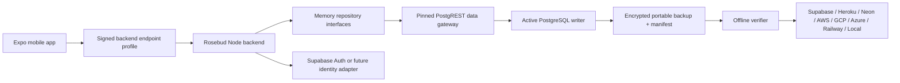

# Rosebud Backend and Database Portability Design

**Status:** Approved for implementation

**Date:** 2026-07-28

**Companion design:** `docs/superpowers/specs/2026-07-28-cloud-authoritative-rosebud-memory-design.md`

## 1. Executive summary

Rosebud's cloud memory remains authoritative, but no single hosting vendor is allowed to become the only practical way to run or recover it. Supabase is the initial PostgreSQL and Auth provider, Heroku Eco is the initial Node backend host, and the same backend can run on a Windows laptop without a fork.

Portability is implemented as rehearsed quiesced planned cutover and fenced emergency recovery, not live multi-provider dual writing. At any moment exactly one externally leased database is writable for a Rosebud deployment. A cutover freezes and independently fences writes, captures a final portable backup, verifies it, restores and verifies the destination, issues a new lease, observes the new system, and retains the source read-only for rollback evidence.

The system supports:

1. Heroku backend with Supabase PostgreSQL and Auth.
2. Laptop backend with Supabase PostgreSQL and Auth.
3. Heroku or laptop backend with another managed PostgreSQL provider while retaining Supabase Auth.
4. Local laptop backend and PostgreSQL with cloud identity for data/runtime independence.
5. A later fully offline identity mode or full Supabase exit as a distinct and explicitly rehearsed operation.

Quality, evidence integrity, recoverability, and understandable operator behavior outrank minimum cost.

## 2. Goals

- Keep the backend artifact provider-neutral and runnable on Heroku or Windows.
- Keep the authoritative memory schema on portable PostgreSQL primitives wherever practical.
- Make database destination selection configuration-driven.
- Produce encrypted, checksummed, provider-neutral backups with machine-readable manifests.
- Make every migration resumable, observable, and reversible before source retirement.
- Prove record counts, ownership, relationships, revision chains, evidence spans, jobs, and semantic samples after restore.
- Preserve one authoritative writer throughout migration.
- Let a phone switch between cloud and laptop endpoints without rebuilding the app.
- Recover safely from Eco dyno sleep, laptop sleep, process restart, and leased-job interruption.
- Provide validated runbooks and scripts for seven cloud/database targets plus local PostgreSQL, with unrehearsed targets labeled experimental.
- Provide platform-specific AI-agent prompt wrappers that guide agents through the same safe migration protocol.

## 3. Non-goals

- Active-active PostgreSQL across unrelated providers.
- Continuous application-level dual writes.
- Automatic deletion of the old database after cutover.
- Provider-specific rewrites of the memory domain.
- Treating a logical backup as the only backup of user data.
- Exposing PostgreSQL directly to the mobile app after leaving Supabase.
- Silent full identity-provider migration.
- Requiring a permanently awake Heroku worker dyno.
- Promising uninterrupted availability during an emergency cutover.

## 4. Core invariants

1. Exactly one active writer lease may accept mutations.
2. Every mutation carries deployment ID, writer epoch, lease ID, and lease token; a PostgreSQL RPC verifies all four plus lease expiry inside the same transaction as the mutation.
3. Maintenance mode rejects new writes before the final source snapshot.
4. No destination becomes authoritative until verification has passed.
5. No source is destroyed automatically.
6. Backup artifacts are immutable, encrypted, checksummed, and described by a manifest.
7. Restore verification never relies only on a successful command exit.
8. Provider overlays may add operational helpers but may not change canonical memory semantics.
9. Auth identity mapping is explicit and tested separately from database copying.
10. Queued work is durable in PostgreSQL; in-memory workers are accelerators, not authorities.
11. Expired job leases are reclaimable after process or machine sleep.
12. Local mode uses the same compiled backend and repository interfaces as cloud mode.
13. Migration tooling logs identifiers and counts, never journal contents or secrets.
14. Rollback is a first-class tested path, not prose appended after a successful migration.
15. Planned cutover revokes the source writer credential or makes the source database read-only before the final snapshot.
16. Emergency cutover cannot reopen writes until the last externally issued source lease has expired or the source has been independently fenced.
17. A separately retained deletion ledger is replayed after every restore, including restores from backups created before a deletion.

## 5. Architecture

The backend owns memory APIs and persistence repositories. The mobile app never knows provider-specific database details. It knows only a backend endpoint profile, its authentication session, and the advertised memory-authority state. Supabase's managed PostgREST is the first data gateway. Other PostgreSQL targets initially pin PostgREST 14.16 by official release-asset SHA-256 on the private side of the Node backend, avoiding a second domain implementation or an untracked Node database dependency. Version changes require the same compatibility and disaster-recovery matrix as a schema change.

### 5.1 Provider-neutral core

The canonical schema uses:

- PostgreSQL tables, constraints, indexes, functions, and transactions;
- `uuid`, `timestamptz`, `jsonb`, arrays, generated columns only when supported by all targets;
- `pgvector` only behind an explicit capability check and rebuild path;
- deterministic migration files;
- repository methods with owner scoping through a stable PostgREST/RPC data-gateway contract;
- logical backup and restore.

Provider-neutral migrations live in one ordered directory and must succeed against supported PostgreSQL versions. Supabase-specific grants, RLS integration, and Auth helpers live in an overlay. Other provider overlays contain only permissions, extensions, connection settings, or operational integration.

The data-gateway contract is also portable:

- Supabase mode uses its managed PostgREST endpoint.
- Generic mode runs a pinned PostgREST binary bound to loopback/private networking.
- The public internet never reaches the sidecar directly.
- The Node backend forwards the verified user JWT for owner-scoped reads and writes.
- On generic targets the Node backend exchanges the verified Supabase session for a short-lived, audience-bound internal gateway JWT containing `role=rosebud_user`, `sub`, `owner_id`, deployment ID, writer epoch, lease ID, and expiry.
- PostgREST verifies an asymmetric local JWKS whose private signing key is available only to the active backend. Rotation publishes old and new public keys through an overlap window.
- Server workflows use a separately rotated `rosebud_worker` internal gateway JWT.
- Canonical migrations create a non-login schema-owner role, `rosebud_user` and `rosebud_worker` runtime roles with no `BYPASSRLS`, `FORCE ROW LEVEL SECURITY`, `USING` plus `WITH CHECK` policies based on transaction-local JWT claims, and composite `(owner_id, id)` foreign keys.
- Multi-statement atomic behavior is exposed through versioned PostgreSQL RPC functions, not simulated with several HTTP calls.
- PostgREST binary version and configuration fingerprint are captured in every backup manifest and deployment health report.

### 5.2 Backend runtime

One Node/TypeScript backend artifact and one pinned data-gateway contract support:

- `cloud` runtime mode on Heroku;
- `local-compute` mode on a laptop while using a cloud database;
- `fully-local` mode on a laptop with local PostgreSQL;
- `maintenance` mode that serves reads and health but rejects writes;
- `migration-verify` commands that never start the HTTP listener.

Runtime selection is configuration-driven. No source branch or special build exists for local mode.

On Supabase, the managed data gateway runs outside the backend process. On generic PostgreSQL, the runtime supervisor starts pinned PostgREST first, waits for its loopback health check, then starts Node. Heroku packages the sidecar through a reproducible build step; Windows setup downloads and verifies the same signed release checksum. The sidecar is never downloaded silently at request time.

### 5.3 Repository and capability boundaries

The backend exposes narrow repositories for source evidence, claims, entities, episodes, preferences, projections, jobs, traces, imports, and authority state. Repositories consume an injected data-gateway interface and never import a vendor SDK. Atomic repository methods call versioned RPCs that own their PostgreSQL transaction.

Provider capabilities are detected and recorded:

- PostgreSQL server version;
- installed extensions and versions;
- vector index support;
- row-level-security mode;
- logical backup compatibility;
- statement timeout and connection limit;
- advisory-lock support.
- pinned PostgREST compatibility and JWT verification mode.

Unsupported optional capabilities degrade to a documented alternative, such as exact vector scan during rebuild. Unsupported required capabilities fail preflight.

### 5.4 External writer lease

The memory database cannot prove by itself that a cloned database is no longer authoritative. Rosebud therefore uses a lease signed outside the memory database:

- the operator holds an Ed25519 writer-authority private key outside every backend and backup;
- a lease document names deployment ID, writer epoch, lease ID, database fingerprint, issued time, and expiry;
- the backend receives the signed lease through a secret file/config value and cannot mint or extend it;
- the database stores only the active lease metadata and token digest;
- every mutating RPC verifies the supplied lease inside its transaction;
- normal leases expire within 24 hours and the app warns before expiry;
- renewing a lease is an explicit operator automation with single-flight compare-and-swap, audit output, and access to the external signing key;
- planned cutover revokes the source database writer credential or applies provider-level read-only fencing, then waits for active transactions to drain;
- emergency failover without independent source fencing waits until the previous signed lease expires before issuing the destination lease.

The initial trusted-circle deployment may keep the writer-authority key on the prepared operator laptop with an encrypted offsite recovery copy. It is never stored on Heroku, in Supabase, in a database dump, or in a mobile endpoint profile.

## 6. Authority and cutover protocol

### 6.1 Authority record

The database contains a singleton deployment authority record:

- `deployment_id`
- `writer_epoch`
- `writer_lease_id`
- `writer_lease_token_digest`
- `writer_lease_expires_at`
- `mode`: `active`, `maintenance`, `read_only`, `retired`
- `backend_base_url`
- `database_fingerprint`
- `changed_at`
- `change_reason`

The backend may cache public bootstrap metadata briefly. It never performs an application-only write check: every mutation is a versioned PostgreSQL RPC that checks deployment ID, writer epoch, lease ID, lease token digest, lease expiry, and deployment mode in the same transaction as the write. A stale or expired lease returns a machine-readable refresh-required error. Client epoch metadata helps refresh UX but is not the security fence.

### 6.2 Planned quiesced cutover

1. Run destination preflight and extension compatibility checks.
2. Create and verify a rehearsal backup while the source remains writable.
3. Restore the rehearsal into an isolated destination database.
4. Run structural, ownership, count, checksum, and semantic probes.
5. Fix all discrepancies and repeat until clean.
6. Announce maintenance locally in the app.
7. Set source authority to `maintenance`.
8. Revoke the source writer credential or apply provider-level database read-only fencing.
9. Drain active write requests and wait for durable jobs to reach a safe checkpoint.
10. Expire or release outstanding job leases.
11. Confirm no mutating RPC can succeed with the source credential.
12. Capture the final encrypted backup and manifest.
13. Verify artifact hashes before transfer.
14. Create a fresh empty destination, apply canonical migrations plus its provider overlay, and restore application data only.
15. Replay the latest deletion ledger and verify its high-watermark.
16. Run the complete verifier.
17. Issue an externally signed destination writer lease with a new epoch.
18. Change the backend database connection and endpoint profile.
19. Start the backend in read-only smoke mode and run live probes.
20. Enable writes after probes pass.
21. Observe error rate, job recovery, and sample recalls.
22. Keep the source read-only through the rollback window.

### 6.3 Emergency cold cutover

When the source cannot accept a maintenance transition:

1. Fence the old backend at routing/configuration and attempt provider-level credential revocation.
2. If independent fencing cannot be proven, wait until its last externally signed writer lease expires.
3. Use the newest verified backup plus the latest separately retained deletion ledger.
4. Record the known recovery point and potential data-loss window.
5. Restore into a fresh target, replay deletions, verify, and issue a new externally signed lease.
6. Require clients to refresh authority state before writing.
7. Preserve the failed source for forensic comparison.

The UI must communicate that recovery used the latest verified checkpoint; it must not imply that unconfirmed recent turns are safely persisted.

### 6.4 Rollback

Rollback follows the same fencing discipline:

1. Freeze and independently fence destination writes.
2. Capture and verify a complete destination snapshot plus the latest deletion ledger.
3. Create a fresh empty database at the rollback provider; never merge destination-era changes into the retained stale source.
4. Apply canonical migrations and the rollback-provider overlay.
5. Restore the complete destination snapshot and replay deletions.
6. Verify all source-era and destination-era revisions, tombstones, jobs, and counts.
7. Issue a new externally signed lease and increment the writer epoch again.
8. switch connections and endpoints.
9. observe in read-only smoke mode before reopening normal operation.

A configuration flip, ad hoc delta merge, or reuse of a stale populated source is not a valid rollback.

## 7. Backup artifact

Each backup set contains:

- a PostgreSQL custom-format logical dump of canonical Rosebud application schemas/data only;
- a schema-only SQL dump for inspection;
- a provider-neutral data manifest;
- migration ledger and schema fingerprint;
- extension inventory;
- table row counts per owner and globally;
- deterministic content hashes for stable canonical projections;
- attachment/object manifest when file storage is introduced;
- restore instructions version;
- tool versions;
- source database fingerprint;
- writer epoch and recovery timestamp;
- encrypted secrets-independent configuration template;
- detached checksum file.

Supabase-owned `auth`, `storage`, realtime, extension, ownership, and provider-administration schemas are excluded. Restore first applies canonical migrations and the destination overlay, then restores data with no-owner/no-ACL behavior. Canonical Rosebud tables never foreign-key to `auth.users`; immutable external subject IDs are ordinary owner identifiers.

Backups are encrypted before leaving the machine that created them. Encryption keys are not stored beside artifacts. Secret values, raw access tokens, and provider credentials are excluded. The manifest is authenticated by the encryption envelope and also signed by the operator backup key. At least one verified encrypted copy lives off the backend/laptop in versioned or object-locked storage. The operator recovery key has one encrypted offsite escrow copy and a documented rotation ceremony.

The logical artifact is supplemented by provider-native point-in-time recovery or snapshots when the selected provider supports them. Native recovery is defense in depth; the portable logical artifact remains the cross-provider path.

### 7.1 Deletion survival

Every source edit, tombstone, account erase, and backup-key retirement appends a hash-chained deletion receipt to `memory_deletion_ledger` in the active transaction. A redacted/encrypted receipt stream is exported after each deletion to two locations independent of ordinary database backups. The stream records owner ID, source/revision IDs, deletion kind, monotonically increasing high-watermark, timestamp, previous receipt hash, and current receipt hash—never deleted prose.

Restore is incomplete until it loads the newest deletion stream, verifies its signature/hash chain/high-watermark, replays receipts newer than the backup watermark, proves deleted evidence and derived projections are absent or ineligible, and writes a fresh post-restore backup.

“Erase all” rotates or destroys the erased owner's backup encryption key material where per-owner encryption is available and explicitly purges all retained portable artifacts containing that owner. Until per-owner backup encryption exists, erase-all blocks completion and reports which shared backup sets must be destroyed and regenerated.

### 7.2 Schedule

- Daily portable backup while the system is in active personal use.
- On-demand backup before every migration, schema release, or destructive maintenance.
- Weekly restore verification into a disposable database when infrastructure allows.
- Monthly full disaster-recovery rehearsal alternating cloud and local targets.

The schedule uses a PostgreSQL single-flight lock and a durable due-at record. Heroku Scheduler or another wake mechanism is only a trigger: backend startup and authenticated maintenance requests detect missed work and catch up. A missed verified backup emits a visible operator alert. Overlapping triggers converge on one operation. Long backups use an explicit monitored one-off process and are not assumed to finish within a short scheduler invocation.

Retention defaults to 14 daily, 8 weekly, and 12 monthly verified sets, subject to the user's storage capacity. A retention job may delete only backups that are superseded by verified newer sets and are outside the rollback window.

### 7.3 Recovery objectives

RTO starts when the operator begins the documented recovery command and ends when authenticated read/write probes pass on the new active writer. RPO is the time between the newest successfully recovered committed mutation and the fencing instant. Initial quality-first objectives:

- Local-compute recovery using Supabase: RTO 15 minutes.
- Restore to an already-provisioned managed PostgreSQL target: RTO 60 minutes for the expected personal dataset.
- Local data/runtime restore on the prepared laptop: RTO 120 minutes.
- Normal RPO: 24 hours from daily backup, reduced to near-zero for planned cutovers using the final fenced snapshot.

Actual rehearsal timings replace estimates in the runbook.

## 8. Restore verification

Verification is layered and fails closed:

1. Artifact integrity: encryption opens, checksums match, manifest parses.
2. Environment: required PostgreSQL version and extensions exist.
3. Schema: canonical migration ledger/objects/constraints/indexes match, while provider-overlay policies/functions pass semantic owner-isolation equivalence tests.
4. Counts: global and per-owner row counts match expected values.
5. Ownership: no cross-owner foreign keys or orphaned evidence.
6. Revision integrity: immutable source revisions and tombstones form valid chains.
7. Queue integrity: job states, leases, attempts, and idempotency keys are valid.
8. Content samples: deterministic samples hash identically after normalization.
9. Semantic probes: known one-year-life queries return the required evidence sets.
10. API probes: authenticated reads, rejected cross-user reads, writes, edit, delete, and recall work through the backend.
11. Restart probes: backend restart and lease recovery do not lose or duplicate committed work.
12. Rollback probe: a complete destination snapshot, including post-cutover canaries and deletion watermark, restores into a fresh database at the rollback provider.

The verifier writes a signed JSON report with each check, evidence counts, duration, and final verdict. A migration cannot switch authority on a warning-only report; all required checks must pass.

Restore targets must be newly created and empty. `pg_restore` uses exit-on-error, single-transaction, no-owner, and no-privileges behavior where supported. An interrupted or failed restore is never resumed into the partial target: the target is marked failed, a new empty target is created, and restore restarts from the verified artifact. Only a verified replacement may be promoted.

## 9. Authentication portability

### 9.1 Database-only migration

The preferred emergency migration moves PostgreSQL while retaining Supabase Auth. The backend validates Supabase JWTs and maps the immutable Supabase user ID to `owner_id`. The new database stores the same owner IDs. On a generic target, the backend then mints a short-lived internal gateway JWT; PostgREST never receives the upstream refresh token.

The backend duplicates owner scoping, while generic PostgreSQL enforces it independently using forced RLS, non-owner/no-bypass runtime roles, transaction-local internal JWT claims, and composite owner foreign keys.

### 9.2 Full Supabase exit

A full identity migration is a separate project with:

- exportable user identity inventory;
- new identity-provider adapter;
- immutable old-to-new subject mapping;
- forced session refresh;
- credential/password migration limitations documented honestly;
- recovery and account-linking path;
- two-user isolation tests;
- explicit cutover and rollback rehearsals.

Database portability must never pretend that copied `auth.users` rows alone constitute a safe identity migration.

## 10. Laptop survival modes

### 10.1 Local compute with cloud data

The fastest emergency option runs the backend on Windows while continuing to use Supabase PostgreSQL and Auth:

- one PowerShell setup command validates Node, configuration, certificates, and connectivity;
- generic mode validates or installs the pinned PostgREST sidecar from a checksummed release;
- one start command runs migrations in verify-only mode, starts the backend, and prints health;
- the phone switches to a signed local endpoint profile;
- LAN access is allowed only on an explicitly configured interface;
- Tailscale or an equivalent private tunnel is preferred outside the LAN;
- laptop sleep is normal; the mobile app retries safely and reports temporary unavailability;
- expired jobs are reclaimed when the backend resumes.

### 10.2 Local data/runtime with cloud identity

Local data/runtime mode adds prepared PostgreSQL on the laptop:

- restore the newest verified portable backup;
- run the full verifier;
- create a new writer epoch;
- run local PostgreSQL plus the loopback-only pinned PostgREST sidecar and the same backend artifact;
- use Supabase Auth with asymmetric signing keys and a bounded, tested JWKS cache while internet is available;
- bind database access to localhost;
- make encrypted local backups to a second physical location when possible.

The mobile phone still talks to the backend, never directly to PostgreSQL.

This mode is not called fully offline. If Supabase Auth is unavailable beyond the safe JWKS/session window, new writes fail closed. Fully offline identity is a later prerequisite-gated subsystem with its own account recovery, revocation, and device-loss review.

### 10.3 Mobile endpoint profiles

Endpoint switching is an application feature, not an environment-variable rebuild. Profiles contain:

- display name;
- HTTPS base URL;
- expected deployment ID;
- pinned public-key fingerprint or signed discovery document;
- signer key ID, writer lease ID/expiry, issued time, expiry, and signature;
- last verified health time;
- active/inactive state.

Activating a profile requires a health/bootstrap response whose deployment ID, writer epoch, writer lease ID/expiry, and signature match expectations. Profiles are signed by the operator endpoint-authority key, whose public trust root is installed with the app or through an explicit local pairing ceremony. Signing-key rotation requires an overlap document signed by both old and new keys. The app refuses endpoints that advertise a conflicting active writer unless the user is in an explicit migration flow.

### 10.4 Returning to cloud

Returning from local follows the normal cutover:

- fence local writes;
- create the final local backup;
- restore and verify the cloud destination;
- assign a new epoch;
- switch endpoint profile;
- keep the local database read-only through the rollback window.

## 11. Heroku Eco behavior

The initial deployment uses one Eco web dyno and no continuously running worker dyno.

- Durable jobs live in PostgreSQL.
- The web process claims bounded work after requests, at scheduled wake opportunities, or through explicit maintenance commands.
- Durable due-at records plus single-flight locks make startup/request wakes catch up missed backup and curation work; scheduler delivery itself is never treated as proof of execution.
- A sleeping dyno is expected and must not be kept awake by a pinger.
- First-request wake latency is exposed as reconnecting/waking behavior, not a failed journal turn.
- Leases expire and are safely reclaimed after dyno restart.
- Release-phase migrations are bounded and backward compatible; heavy rebuilds run as explicit one-off tasks.
- If Eco hours or Heroku billing becomes unavailable, local-compute mode is the primary rapid fallback.

## 12. Destination matrix

The migration matrix documents:

1. Supabase PostgreSQL.
2. Heroku Postgres.
3. Neon.
4. Amazon RDS for PostgreSQL or Aurora PostgreSQL-compatible.
5. Google Cloud SQL for PostgreSQL or AlloyDB.
6. Azure Database for PostgreSQL.
7. Railway PostgreSQL.
8. Generic/self-hosted PostgreSQL, including the prepared Windows laptop.

Each destination adapter supplies:

- provisioning checklist;
- connection/TLS format;
- required extensions;
- import constraints;
- connection pool guidance;
- backup/restore commands;
- provider-specific verification;
- rollback notes;
- PostgREST sidecar packaging, private binding, role, JWT/JWKS, and health configuration when managed PostgREST is unavailable;
- teardown steps that are manual and disabled by default.

Supabase, generic/local PostgreSQL, and the first successfully rehearsed non-Supabase managed target are `verified`. Other descriptors remain `experimental` until their real TLS, extension, role, restore-permission, sidecar, API, and rollback drill passes. Static validation alone never upgrades support status.

## 13. Migration command surface

The repository provides provider-neutral commands:

- `preflight`
- `backup`
- `verify-backup`
- `restore`
- `verify-restore`
- `enter-maintenance`
- `drain`
- `assign-epoch`
- `smoke`
- `cutover`
- `rollback`
- `drill`

Commands support `--dry-run` where meaningful, produce JSON reports, return nonzero on failed required checks, redact credentials, and require an explicit deployment fingerprint before any state change.

Provider adapters supply data and commands to the common engine; they do not implement independent migration logic.

## 14. AI-agent migration prompt pack

Seven wrappers target Codex, Claude Code, Gemini CLI, GitHub Copilot, Cursor, Cline, and ChatGPT. They guide agents but are not a security boundary. Every wrapper points to the same canonical migration runbook and includes these non-negotiable rules:

- inspect before changing;
- never print credentials;
- never invent a provider response;
- never dual write;
- never skip maintenance fencing;
- run backup and restore verification;
- show actual command output and exit status;
- stop on ownership, count, checksum, or semantic mismatch;
- do not delete the source;
- produce a timestamped operator report;
- distinguish performed actions from suggested console steps;
- use provider-native APIs or CLIs only when credentials and authorization exist.

The wrappers differ only in tool syntax and context-loading instructions. The migration protocol remains identical.

## 15. Observability and privacy

Migration and recovery events record:

- operation ID and type;
- source and destination fingerprints;
- writer epochs;
- start/end time;
- phase durations;
- table counts and discrepancy summaries;
- backup artifact IDs and hashes;
- tool versions;
- pass/fail result;
- operator or agent identity;
- rollback window.

Logs must not contain journal prose, extracted trauma details, raw prompts, embeddings, JWTs, passwords, connection URLs with credentials, or encryption keys. Semantic verification stores probe identifiers and scores, with sensitive expected evidence kept in encrypted fixtures.

## 16. Testing and sabotage

Real verification is required:

- migrations run against actual PostgreSQL, not a string parser alone;
- two real database roles prove owner isolation;
- backup and restore use real `pg_dump`/`pg_restore`;
- the destination backend performs real authenticated API calls;
- a real phone/web app switches endpoint profiles;
- a sleeping/restarted backend reclaims a real leased job;
- a deliberately corrupted checksum fails;
- a deliberately missing extension fails preflight;
- a deliberately stale epoch, wrong token, or expired writer lease rejects the mutating RPC transaction;
- a deliberately interrupted restore is rerun safely;
- a deliberately mismatched owner count blocks cutover;
- a real rollback restores a complete destination snapshot, including post-cutover writes and deletions, into a fresh rollback target;
- a cleared-data live memory recall probe uses verbatim assistant output.

Mocks may isolate paid AI providers in unit tests but cannot replace database, migration, authority, or recovery tests. Every regression test must demonstrate red before green, including deliberate sabotage when the implementation already exists.

Red/green and sabotage claims are retained as timestamped command reports containing the tested commit, exact command, exit status, failing assertion/category, and restored passing result. Reports are redacted and hashed; a prose statement that a sabotage was performed is not evidence.

## 17. Delivery sequence

1. Add authority contracts, repository boundaries, provider-neutral schema rules, and portability guards in Phase 0.
2. Add backup manifests, verification, and Supabase-to-local rehearsal before MIRROR ingestion can be called complete.
3. Add endpoint profiles and local-compute launcher before cloud authority cutover.
4. Add one managed-provider rehearsal, initially Heroku Postgres or Neon, before local retirement.
5. Add all remaining provider adapters and AI prompt wrappers.
6. Rehearse rollback and record measured RPO/RTO.
7. Only then allow CLOUD authority to retire local legacy memory stores.

## 18. Completion gates

Portability is complete only when:

- the same Node backend build runs on Heroku and Windows with platform-specific, checksum-verified PostgREST packaging;
- Supabase-to-local and local-to-Supabase rehearsals pass;
- one non-Supabase managed PostgreSQL rehearsal passes;
- all eight destination runbooks pass static validation;
- the seven AI-agent wrappers contain the canonical safety rules;
- encrypted backup and restore verification pass with real tools;
- transactional stale-epoch/expired-lease, corruption, deletion-replay, cross-user, restart, and full-snapshot rollback sabotage tests pass;
- the app switches endpoints without rebuild and refuses conflicting authority;
- actual rehearsal RPO/RTO and limitations are documented;
- no old source was automatically deleted;
- every verified generic target proves internal-JWT claim propagation, non-bypass forced RLS, and private sidecar binding;
- independent review finds no unresolved critical or important issue.
